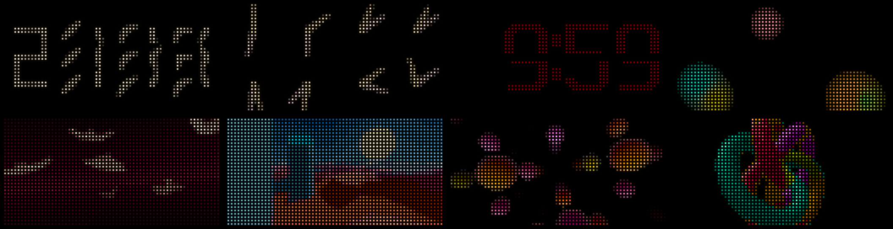
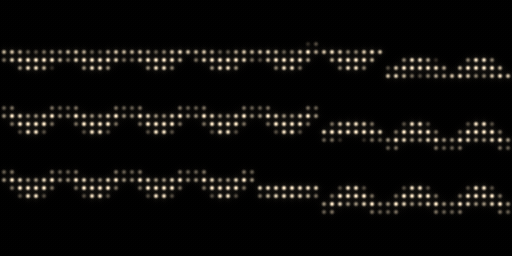
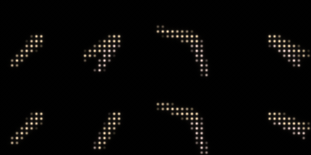
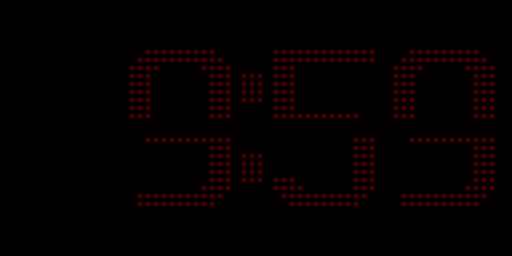
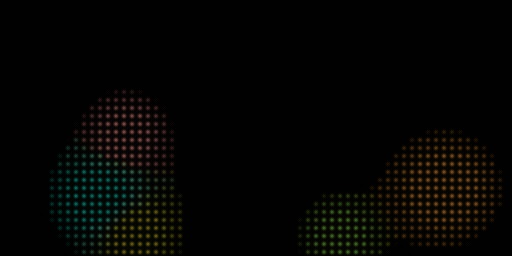
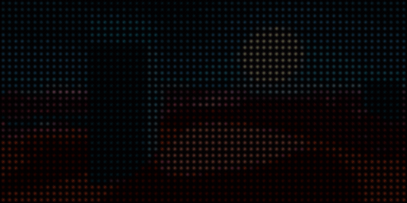
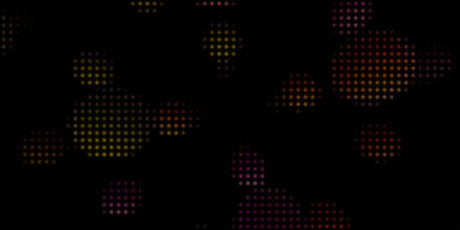
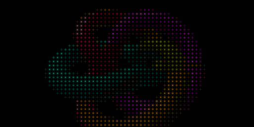
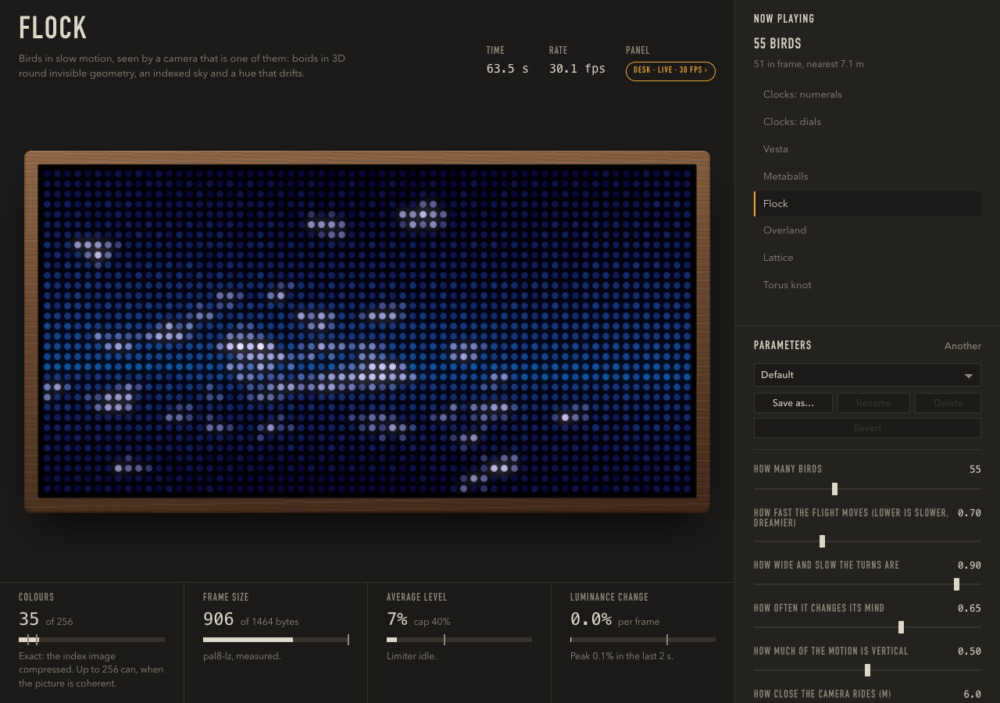

# screeny

**A Tidbyt, turned into a 30 fps window for generative art.**

Custom Rust firmware makes the Tidbyt's 64x32 LED panel a network frame buffer: it
shows whatever arrives over WiFi, thirty times a second. Everything interesting then
happens on a computer, where there is room for it: a generative art system, clocks
that dance, a web page that is a live window onto the panel, and a service that keeps
it all running for months without anyone looking at it.



<!-- REAL PANEL FOOTAGE: drop a phone clip here as docs/media/panel-*.gif and
     replace this comment. GIFs in the README play inline; MP4 does not. -->

## Why

The Tidbyt is a lovely object: a wooden box with a 64x32 RGB LED matrix behind a
diffuser, and an ESP32 inside. Out of the box it draws apps that a cloud service
renders for it, a frame or two a minute, over a link it does not control.

This project keeps the box and replaces the software with something smaller and
faster. The firmware does one job well, and everything that is hard about drawing
pictures moves to a machine that has a real CPU, a GPU if you like, and a proper
programming language. The panel becomes a display, not a product.

What that buys:

- **30 frames a second**, at the panel's native depth, with gamma correction and
  temporal dithering done on the device. Motion reads as motion.
- **Anything can drive it.** The wire format is one UDP datagram per frame. A Rust
  library and CLI do the encoding, and `screeny pipe` takes raw RGB frames on stdin
  from any program in any language.
- **A generative art system** built for this panel: eight patches so far, each with
  named, saved settings, tuned for 2048 LEDs seen from across a room.
- **A web page that is the panel.** Screeny Studio streams to the panel and shows in
  the browser the very frames the panel is receiving. Move a slider and the panel
  changes. Close the tab and it keeps playing.
- **A device that looks after itself.** WiFi setup through a captive portal with a QR
  code on the panel, its own status page, firmware updates over WiFi that roll back
  when they fail, and a button that resets the network.

## What it looks like

The renders below are the honest output of the pipeline: the exact frames a panel
receives, drawn as LEDs. A real panel is brighter, smaller and better.

| | |
|---|---|
|  | **clocks-numerals.** After ClockClock 24: twenty-four small dials whose hands draw the time in digits, then dance to the next minute. Thirteen choreographies. |
|  | **clocks-dials.** Larger dials in continuous, flowing motion. Once a minute they gather to read the time as analog clocks, then let go. |
|  | **vesta.** A split-flap night clock, red on black, the cards falling under gravity as the minute turns. Built for a dark bedroom. |
|  | **flock.** Birds in slow motion, seen by a camera that is one of them. Each bird has wings, a wrist that folds through the beat, and a lean into its turns. |
|  | **metaballs.** Continuous colour, supersampled in linear light. More than 32 colours, so it shows what the codecs do. |
|  | **overland.** A procedural world painted by palette index, on the GPU. 32 colours, exact on the wire; the day cycle is palette animation. |
|  | **lattice.** Raymarched solids on true black, lit into the mid-to-bright range, for slow flight. |
|  | **knot.** A rasterized mesh with a depth buffer, mapped onto a designed 31-colour palette so every frame is sent exactly. |

Each patch has parameters (the numerals clock has seventeen), a seed, and any number
of named settings you save from the Studio page, like presets on an instrument.

## How it works

```
 patches ──> screeny-art pipeline ──> encoder (best of 5 codecs, <= 1464 B) ──UDP/WiFi──> firmware ──> HUB75 panel
 crates/art                           crates/screeny                                     firmware/
                    Studio: crates/studio                └── crates/proto: one wire format, shared by both ends ──┘
```

**One frame, one datagram.** A frame is an 8-byte header and at most 1464 bytes of
pixels. Nothing is retransmitted, every frame decodes on its own, and the newest one
wins. The sender tries five codecs on every frame and sends the one that scores best
against a model of the panel: two palette-plus-LZ codecs that are bit-exact for the
low-colour, coherent images most art is made of; a 32-colour codec that always fits;
a block codec for photographic content; and a solid-colour one. A clock frame is
about 280 bytes. Every codec holds 30 fps with zero decode drops on the real panel.

**The firmware is small and does not parse anything it did not write.** It is `no_std`
Rust on embassy and esp-hal, with the display on one core and the network on the other.
It refreshes the panel at 154 Hz with six bit planes, gamma-corrects in a lookup table,
dithers temporally to about a thousand levels per channel, and caps brightness by
narrowing the output-enable window rather than by throwing away bits. Discovery is
DNS-SD (`_screeny._udp`); control and telemetry ride a second port; a source lock means
two senders cannot fight over the panel.



**The Studio is one binary.** An axum server with the web page compiled in, no desktop
window, no Node. It runs the same on a laptop and in a container. Players render on
their own threads, a patch that panics or stalls is replaced without the process
dying, and state is a small JSON file written atomically, so a container restart
resumes what was playing. It is built to be forgotten.

**The device has its own web page** at `http://screeny-<id>.local/`: status, network
settings, a firmware upload. With no network it raises an open access point named
`screeny-<id>`, puts a WiFi QR code on the panel, and walks a phone through setup.
Updates over WiFi go into the spare OTA slot, run on trial, and are rolled back by
the bootloader if the new image never proves itself.

The full story, with the measurements, is in [`docs/`](docs/README.md): the
[protocol](docs/design/protocol-v1.md), the [architecture](docs/design/architecture.md),
the [art brief](docs/design/generative-art-brief.md), and eleven research notes on how
each decision was reached.

## Get started

The short version. The long one, with what you need and what you will see at each
step, is [`docs/getting-started.md`](docs/getting-started.md).

```bash
# Try it with no hardware: a simulated panel and the Studio.
cargo run --release -p screeny-sim                 # a fake panel in a window
cargo run --release -p screeny-studio              # http://127.0.0.1:8787/ finds it

# Or drive the simulator from the command line.
cargo run --release -p screeny-art -- play flock --to screeny-sim
cargo run --release -p screeny -- --name screeny-sim clock
```

With a Tidbyt Gen 1: **back up the stock firmware**, write a release image from the
[releases page](https://github.com/gotwalt/screeny/releases), set up WiFi from your
phone, and stream. No firmware toolchain needed; ten minutes.

```bash
pip install esptool
esptool --port /dev/cu.usbserial-XXXX --baud 230400 read-flash 0 0x800000 tidbyt-stock-mine.bin   # keep this
esptool --port /dev/cu.usbserial-XXXX --baud 230400 write-flash 0 screeny-fw-<version>-full.bin
# the panel shows a QR code: scan it, join, enter your WiFi
cargo run --release -p screeny -- discover
cargo run --release -p screeny-art -- play clocks-numerals
```

To change the firmware itself, install the Xtensa toolchain (`espup`) and build in
`firmware/`; the guide has the steps and `tools/fw-run.sh` flashes the result.

To run the Studio as a service on a Linux box, see
[`docs/design/deployment.md`](docs/design/deployment.md): a Dockerfile, a compose
file, and a script that deploys over SSH.

## Hardware

**Tested only on the Tidbyt Gen 1** (ESP32-D0WD, 8 MB flash, the version with a blue
reset button on the back). One unit, since September 2026.

**Tidbyt Gen 2 is untested and will need small firmware changes.** It is the same
ESP32 family and the same 64x32 panel, so the protocol, the host tools and the Studio
are unaffected, but from Tidbyt's own firmware it is known that Gen 2 has a different
HUB75 pin map, the opposite pixel-clock phase, and a capacitive touch pad on GPIO33 in
place of the mechanical button on GPIO15. The places to change are
`firmware/src/tidbyt.rs` (the pin constants) and the pin block in `firmware/src/main.rs`;
[`docs/research/001-firmware-stack.md`](docs/research/001-firmware-stack.md) has both
pin maps side by side. If you make it work, please send it back.

Some Gen 1 units have the colour lines in the order Tidbyt's firmware publishes; the
author's unit has them rotated. If `screeny pattern` shows the wrong colours, rebuild
with the other pin order (`--features panel-hdk-colours`).

The panel runs from USB power. The firmware caps brightness and the art system limits
average lit area, so a laptop port is enough; do not lift those limits without a
supply that can take it.

## The repository

| Path | What |
|---|---|
| `firmware/` | The ESP32 firmware. A separate cargo project on the `esp` toolchain. |
| `crates/proto` | The wire format and the five decoders. `no_std`, no dependencies, shared by both ends. |
| `crates/receiver` | The receive state machine (source lock, timeouts, idle), shared by the firmware and the simulator. |
| `crates/screeny` | The sender library and the `screeny` CLI: discovery, encoding, pacing, control. |
| `crates/art` | The generative art system and the headless `screeny-art` binary. |
| `crates/studio` | Screeny Studio: HTTP + WebSocket server with the UI built in. |
| `crates/sim` | A simulated panel that speaks the whole protocol, HTTP API included. Window or headless. |
| `crates/probe` | `screeny-probe`: the conformance suites (wire and HTTP), paced streams, firmware upload. |
| `crates/demos` | Two reference senders: an endless fractal zoom and a word clock. |
| `crates/panel`, `encode`, `dither`, `settings`, `provision`, `device-api`, `fwimage`, `otastate` | The smaller shared pieces: the panel model, the encoders, the dither arithmetic, the settings store, WiFi provisioning, the device HTTP API shapes, firmware image validation, OTA state. Most are `no_std` and host-tested. |
| `docs/design/` | The settled decisions. `docs/research/` is how they were reached. |
| `lab/` | The codec measurement lab, frozen as a reference. |
| `tools/` | Flashing, backup, rendering the README media, macOS signing, deployment. |

`cargo test` at the root runs every host crate; the firmware builds in `firmware/`
with the `esp` toolchain. Clippy is expected to say nothing.

## Status

It works, and it has run on a shelf day and night since the day it first did. It is a hobby project by one person,
built to be looked at rather than sold, and its sharp edges are documented rather
than filed off: there is no authentication on the Studio or the device (do not expose
them past your LAN), discovery does not work from a container on a Mac, and only one
panel has ever run it.

Tidbyt is a product of Tidbyt, Inc. This project is not affiliated with them and
replaces their firmware entirely; keep the backup so you can go back.

## License

[MIT](LICENSE).
