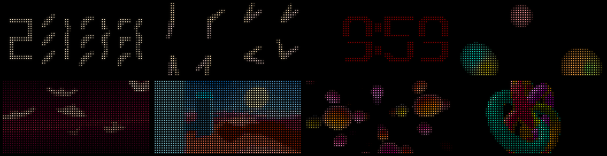
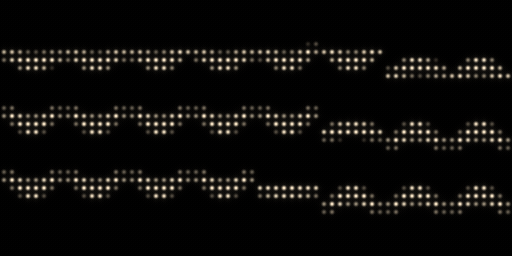
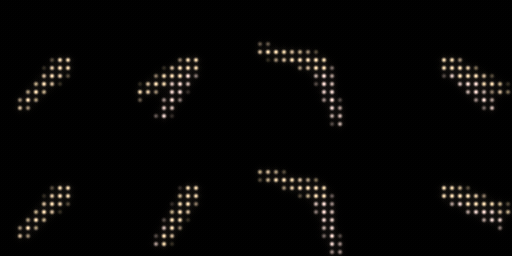
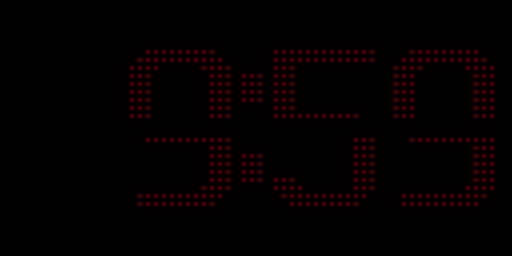
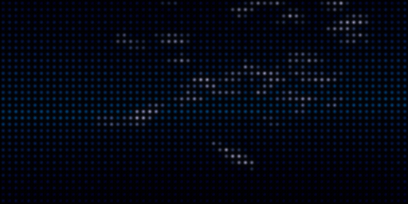
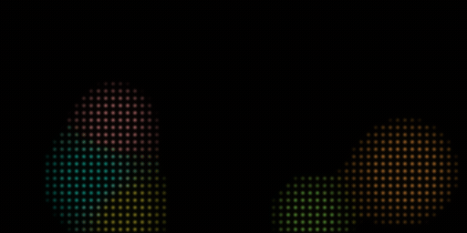
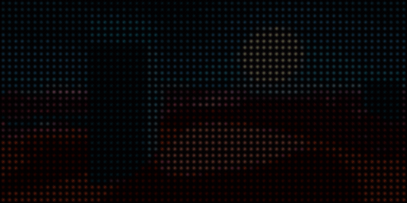
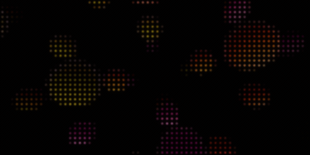
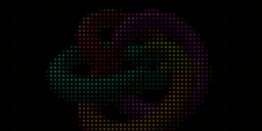
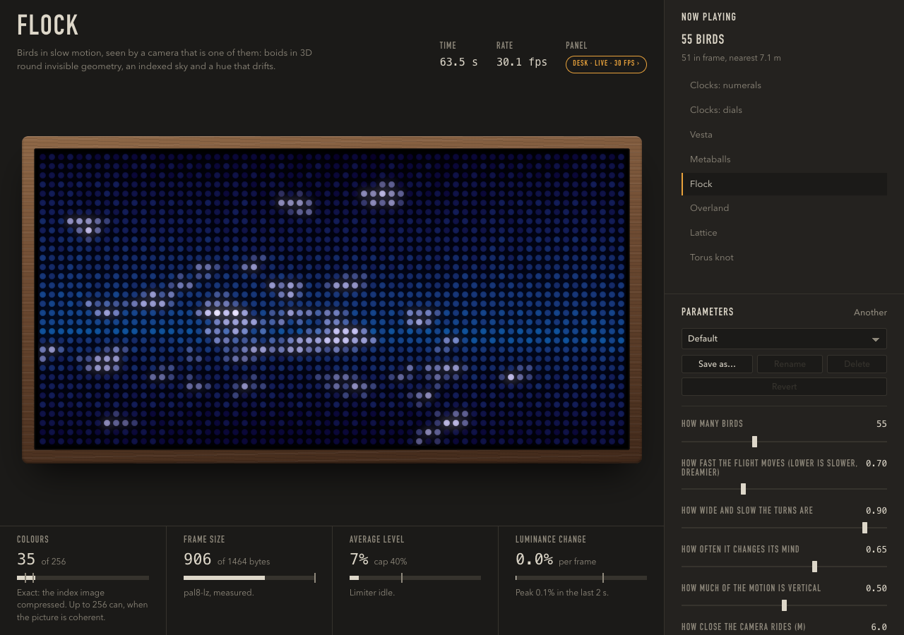

# screeny

**Turn a Tidbyt into a 30 fps window for generative art.**

Screeny is new firmware for the Tidbyt Gen 1, plus a small server that draws for it.
The Tidbyt's 64x32 LED panel becomes a network display that shows whatever arrives
over WiFi, thirty times a second. The pictures come from Screeny Studio, which runs on
a computer you already have (or inside Home Assistant): clocks that dance,
birds in slow flight, a split-flap night clock, and more. No cloud, no account, no
subscription.

https://github.com/user-attachments/assets/0f64a06b-48bb-4760-a3d9-1baab2ff8e12

## Get it running

You need a **Tidbyt Gen 1**, a **USB-C data cable**, and **Chrome or Edge** on a
computer. Fifteen minutes, nothing to install for step 1.

### 1. Flash the Tidbyt from your browser

Open **<https://gotwalt.github.io/screeny/>**, plug the Tidbyt in, click
**Install**, and type your WiFi name and password when it asks (2.4 GHz networks
only). The panel joins your network and shows a status screen.

Changed your mind? Tidbyt's own firmware and instructions are at
[help.tidbyt.com](https://help.tidbyt.com); flashing it puts the panel back as it was.

### 2. Run Screeny Studio

The Studio is what draws the pictures and streams them to the panel. It has to stay
running, so put it on something that is always on. Pick one:

**Home Assistant** (OS or Supervised, on a Pi or a PC):
Settings > Apps > App store > three-dot menu > **Repositories** > **+ Add**, enter
`https://github.com/gotwalt/screeny`, then install **Screeny** and start it. It opens
from the sidebar, finds the panel by itself, and the panel shows up in Home Assistant
as a device you can automate. Step by step, with screenshots:
[`ha-app/DOCS.md`](ha-app/DOCS.md).

What it costs on a Raspberry Pi 4 (4 GB, Home Assistant OS 18.3), measured on a live
install driving two panels from one channel showing the numeral clock: about half of
one core, so roughly 12% of the whole Pi, and about 85 MB of memory. Home Assistant OS
gives apps no GPU on a Pi, so the Studio draws in software. The cost follows the
patch, not the number of panels: a channel draws once for all its panels. Light patches
(flock, bats) use about a quarter of a core; the 3D ones (knot, lattice) use more than a
whole core. The two heaviest (ghosts, overland) are hidden on a Pi. Measurements per patch:
[`docs/design/home-assistant-app.md`](docs/design/home-assistant-app.md).

**Docker** on any Linux machine (amd64 or arm64, e.g. a Raspberry Pi or a home server):

```bash
docker run -d --name screeny --restart unless-stopped --network host \
  -e TZ=America/New_York -v screeny:/data ghcr.io/gotwalt/screeny-studio:latest
```

Then open `http://<that machine>:8787/`. Host networking is required: the Studio finds
panels by mDNS and streams to them over UDP. Set `TZ` to yours so the clocks are right.
Without a GPU it draws on the CPU, which is fine for everything but two heavy patches
(ghosts, overland), which it hides. To give it an Intel or AMD GPU (`/dev/dri`), see
[`docs/design/deployment.md`](docs/design/deployment.md) and `docker-compose.yml`. Docker Desktop on a Mac cannot see the panel; use the next
option there.

**From source**, on macOS or Linux, with [Rust](https://rustup.rs) installed:

```bash
git clone https://github.com/gotwalt/screeny && cd screeny
cargo run --release -p screeny-studio      # then open http://127.0.0.1:8787/
```

On a Mac, allow Local Network access when macOS asks, or the Studio cannot see the
panel.

### 3. Pick something to watch

The Studio's **Picture** screen lists the patches; click one and the panel follows.
Each patch has settings to play with, and you can save the ones you like. The
**Panel** screen has brightness and firmware updates. Several panels can share a
picture or each show their own (channels).

Each panel also has a small page of its own (name, brightness, WiFi, firmware upload).
Open it from the Studio's **Panel** screen, or find panels from a terminal with
`screeny discover`.

## What it looks like

These are the exact frames a panel receives, drawn as LEDs. A real panel is brighter,
smaller and better.



| | |
|---|---|
|  | **clocks-numerals.** After ClockClock 24: twenty-four small dials whose hands draw the time in digits, then dance to the next minute. Thirteen choreographies. |
|  | **clocks-dials.** Larger dials in continuous, flowing motion. Once a minute they gather to read the time as analog clocks, then let go. |
|  | **vesta.** A split-flap night clock, red on black, the cards falling under gravity as the minute turns. Built for a dark bedroom. |
|  | **flock.** Birds in slow motion, seen by a camera that is one of them. Each bird has wings, a wrist that folds through the beat, and a lean into its turns. |
|  | **metaballs.** Continuous colour, supersampled in linear light. |
|  | **overland.** A procedural world painted by palette index, on the GPU, with a day cycle. |
|  | **lattice.** Raymarched solids on true black, for slow flight. |
|  | **knot.** A lit mesh mapped onto a designed palette, so every frame is sent exactly. |

There are seasonal ones too (bats, falling leaves, ghosts). Each patch has
parameters, a seed, and any number of named settings you save from the Studio, like
presets on an instrument.



## Why

The Tidbyt is a lovely object: a wooden box with a 64x32 RGB LED matrix behind a
diffuser, and an ESP32 inside. Out of the box it shows apps that a cloud service
renders for it, a frame or two a minute.

Screeny keeps the box and replaces the software. The firmware does one job well, and
everything hard about drawing moves to a machine with a real CPU, a GPU if you like,
and a proper programming language. What that buys:

- **30 frames a second**, at the panel's native depth, with gamma correction and
  temporal dithering done on the device. Motion reads as motion.
- **Local and private.** Nothing leaves your network.
- **Anything can drive it.** One UDP datagram per frame. A Rust library and CLI do the
  encoding, and `screeny pipe` takes raw RGB frames on stdin from any program in any
  language.
- **It looks after itself.** WiFi setup from the browser or from a phone (the panel
  shows a QR code), firmware updates over WiFi that roll back by themselves if they
  fail, and a button that resets the network.

## Drive it yourself

Everything is in one Rust workspace. No Tidbyt needed to try it: there is a simulated
panel.

```bash
cargo run --release -p screeny-sim                 # a fake panel in a window
cargo run --release -p screeny-studio              # http://127.0.0.1:8787/ finds it

cargo run --release -p screeny -- discover         # list panels on the network
cargo run --release -p screeny-art -- play flock --to screeny-sim
cargo run --release -p screeny -- --name screeny-sim clock
```

[`docs/getting-started.md`](docs/getting-started.md) is the long version: the CLI,
building and flashing the firmware yourself (`espup`, then `tools/fw-run.sh`), and
what to do when something is off.

## How it works

```
 patches ──> screeny-art pipeline ──> encoder (best of 5 codecs, <= 1464 B) ──UDP/WiFi──> firmware ──> HUB75 panel
 crates/art                           crates/screeny                                     firmware/
                    Studio: crates/studio                └── crates/proto: one wire format, shared by both ends ──┘
```

**One frame, one datagram.** A frame is an 8-byte header and at most 1464 bytes of
pixels. Nothing is retransmitted, every frame decodes on its own, and the newest one
wins. The sender tries five codecs on every frame and sends the one that scores best
against a model of the panel. A clock frame is about 280 bytes.

**The firmware** is `no_std` Rust on embassy and esp-hal, with the display on one core
and the network on the other. It refreshes the panel at 154 Hz with six bit planes,
dithers temporally to about a thousand levels per channel, and caps brightness so a
laptop USB port can power it. Discovery is DNS-SD (`_screeny._udp`).

**The Studio** is one binary: an axum server with the web page compiled in. Players
render on their own threads, a patch that stalls is replaced without the process
dying, and state is a small JSON file, so a restart resumes what was playing. It
speaks MQTT to Home Assistant.

The full story, with the measurements, is in [`docs/`](docs/README.md): the
[protocol](docs/design/protocol-v1.md), the [architecture](docs/design/architecture.md),
the [art brief](docs/design/generative-art-brief.md), and the research notes on how
each decision was reached.

## Hardware

**Tidbyt Gen 1 only** (the version with a reset button on the back). Two units have
run it day and night since September 2026.

**Tidbyt Gen 2 is untested and will need firmware changes**: a different HUB75 pin
map, the opposite pixel-clock phase, and a touch pad instead of the button. The places
to change are `firmware/src/tidbyt.rs` and the pin block in `firmware/src/main.rs`;
[`docs/research/001-firmware-stack.md`](docs/research/001-firmware-stack.md) has both
pin maps. If you make it work, please send it back.

If the colours look wrong (red shows as blue, say), the panel's own page has a colour
order setting under Advanced. Every Gen 1 tested so far needs the default.

The panel runs from USB power. The firmware caps brightness and the art system limits
how much of the panel is lit, so a laptop port is enough; do not lift those limits
without a supply that can take it.

## The repository

| Path | What |
|---|---|
| `firmware/` | The ESP32 firmware. A separate cargo project on the `esp` toolchain. |
| `crates/studio` | Screeny Studio: HTTP + WebSocket server with the UI built in, Home Assistant bridge. |
| `crates/art` | The generative art system and the headless `screeny-art` binary. |
| `crates/screeny` | The sender library and the `screeny` CLI: discovery, encoding, pacing, control. |
| `crates/proto` | The wire format and the five decoders. `no_std`, shared by both ends. |
| `crates/sim` | A simulated panel that speaks the whole protocol, HTTP API included. |
| `crates/probe` | `screeny-probe`: conformance suites, paced streams, firmware upload. |
| `crates/*` (the rest) | Smaller shared pieces: receiver state machine, panel model, encoders, dither, settings store, WiFi provisioning, device API shapes, firmware image checks, OTA state, demos. |
| `ha-app/` | The Home Assistant app. |
| `site/` | The web flasher. |
| `docs/` | `design/` holds the settled decisions, `research/` how they were reached. |
| `tools/` | Flashing, releases, rendering the README media, deployment. |

`cargo test` at the root runs every host crate; the firmware builds in `firmware/`.

## Status

It works, and it has been running on a shelf since the day it first did. It is a
hobby project by one person, built to be looked at rather than sold. Known sharp
edges: there is no login on the Studio or on the panel's page, so keep them on your
LAN, and only two panels have ever run it. Issues and pull requests are welcome.

Tidbyt is a product of Tidbyt, Inc. This project is not affiliated with them.

## License

[MIT](LICENSE).
