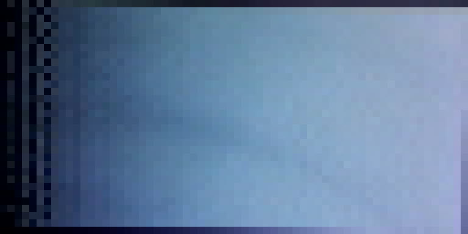
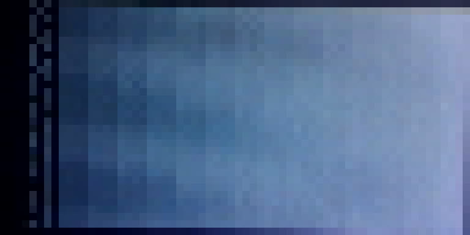
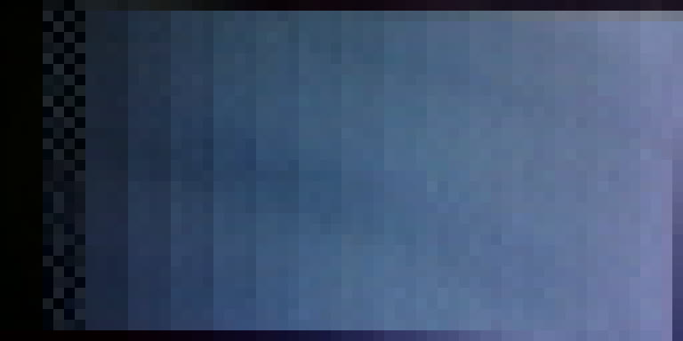
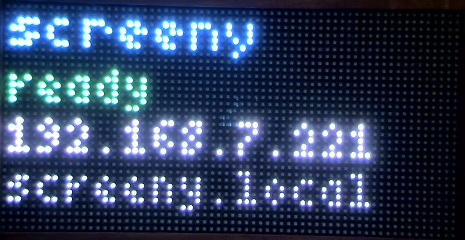
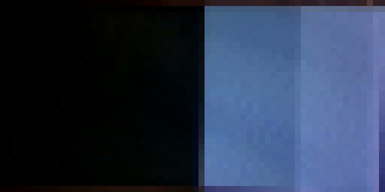

## Goal

Turn the bring-up spike into the real `firmware/` project and make the *display half*
right on the actual panel: correct gamma, no ghosting, brightness control that does
not cost bit depth, known orientation, and a status screen. Networking stays as the
spike has it (raw RGB888 test receiver); card 008 replaces it once `crates/proto`
exists. You are the only worker with hardware access while this card is in `doing/`.

## Context

- Read first: `docs/research/004-first-bringup.md` (what works, what does not),
  `docs/research/001-firmware-stack.md`, `docs/design/architecture.md` (firmware
  section), `docs/research/000-bench-notes.md` (bench quirks), cards 020, 021, 030.
- Start by copying `spike/fw-skeleton` to `firmware/` (package `screeny-fw`). Leave the
  spike frozen. Keep the pinned dependency set; the version window is one release wide.
- This unit's colour lines are rotated relative to the hdk pin names; the spike
  already has the fix. WiFi SSID is `Example-Wifi1` (capital T).
- Build: `. ~/export-esp.sh && cd firmware && cargo build --release`.

### Bench rules (you have hardware access; these are not optional)

- **Always call the bench tools by their absolute path in the main checkout**,
  `/Users/aaron/src/screeny/tools/...`, not the copies in your worktree. The camera
  daemon watches the main checkout's `captures/req/`, so captures and logs land in
  `/Users/aaron/src/screeny/captures/`. Pass `fw-run.sh` an absolute path to your ELF.

- Flash + serial log + camera still in one step:
  `tools/fw-run.sh firmware/target/xtensa-esp32-none-elf/release/screeny-fw NAME [secs]`
  -> `captures/NAME.log`, `captures/NAME.jpg`. It refuses to flash without the stock
  backup. `espflash monitor` resets the chip when it attaches, so logs start at boot.
- Camera only: `tools/cam-request.sh NAME` (still) or `tools/cam-request.sh NAME clip 3`
  (mp4). The capture daemon runs in the owner's Terminal.app; if `cam-request` says it
  is not running, stop and report - do not try to start ffmpeg yourself (the Claude
  app has no camera permission and it just hangs).
- Look at your captures with the Read tool. The panel occupies roughly x 405-1560,
  y 210-805 of the 1920x1080 frame; crop with ffmpeg before reading to save effort.
  The camera auto-exposes and clips on bright LEDs: dim the panel for colour judgements.
- Serial baud must never exceed 230400. One process on the serial port at a time:
  make sure no `espflash` is left running (`pgrep -x espflash`) before flashing.
- To send test frames to the running device, the spike's receiver takes a raw RGB888
  datagram on UDP 49374 (first 490 pixels). The device gets 192.168.7.221 by DHCP
  (check the log) and answers mDNS as `screeny.local`. Python one-liners are fine.
- Keep the brightness cap. The panel is powered from laptop USB. Never display
  full-white full-brightness frames; no flashing patterns above 3 Hz.
- `captures/` is git-ignored. Copy the few images that matter into
  `docs/research/img/` (downscaled JPEG, < 200 KB each).

## Deliverables

1. `firmware/` builds clean, boots, joins WiFi, shows a status screen.
2. **Orientation proven** with an asymmetric pattern (e.g. a corner marker + an "F"
   glyph): origin top-left, x right, y down, no mirroring. Fix if wrong.
3. **Ghosting fixed** (the faint copy of lit rows 1-2 rows below): esp-hub75
   `trail-blank-N` / `inter-row-blank-N` or whatever it takes. Before/after captures.
4. **Gamma**: a 256-entry sRGB8 -> panel-level LUT applied in the display path, so an
   sRGB grey ramp looks perceptually even on camera and mid-grey is not blown out.
5. **Brightness without losing depth** (card 020): investigate OE-duty / blanking-time
   control in esp-hub75 (patch or fork if needed; vendoring under `firmware/vendor/` is
   acceptable) so brightness is a runtime 0-255 value that leaves 6 bit planes intact.
   If that is genuinely not achievable, document why and implement the best fallback.
   Default to a comfortable indoor level that does not clip the bench camera.
6. **Status screen**: tiny bitmap font (5x7 or 4x6), shows "screeny", WiFi state and
   the IP address once known; drawn only when no stream is active.
7. Measure and log: refresh rate, time to convert RGB888 -> DMA buffer (the per-frame
   display cost), free heap. Put a frame-time budget table in your log.
8. Stretch, only if everything above is done: **temporal dithering** (card 030) -
   carry the sub-LSB remainder across refreshes. If you take it on, move card 030 too.
   If not, leave 030 in the backlog with anything you learned.

Fold the outcomes of cards 020 and 021 into their files (move them to review too if
completed; otherwise append what you learned and leave them in backlog).

## Acceptance

Camera captures in the card log show: correct orientation, no visible ghosting, an
even grey ramp, the status screen with a readable IP, and the same image at two
brightness levels with all ramp steps still distinguishable at the lower one. The
device is left running this firmware.

## Log

### Handover: what the first shift built (reconstructed, not written by it)

The first worker on this card was stopped mid-session and wrote no log. This
section is reconstructed from its three commits, the source it left, and its
`captures/c007-*` stills; everything in it was re-verified on the bench by the
second shift unless marked otherwise. Branch `card/007-firmware-display` is
abandoned at `189a430`; work continues on `card/007b-firmware-display` from the
same commit.

**What it did.**

1. `6f5a892` — `spike/fw-skeleton` copied verbatim to `firmware/` as
   `screeny-fw`. Spike left frozen. Deliverable 1's starting point.
2. `075cbcc` — the real display pipeline:
   - `firmware/vendor/hub75-framebuffer` (0.12.0 from crates.io, wired in with
     `[patch.crates-io]` so `esp-hub75` uses the same copy), with **output-enable
     duty brightness** added. This is the important find of the whole card and it
     overturns card 001's and card 020's conclusion. See below.
   - `src/gamma.rs` — a generated 256-entry sRGB EOTF table carrying 4 fractional
     bits below a panel level (`0..=63*16`), so the remainder is available to a
     ditherer instead of being truncated away.
   - `src/display.rs` — the sRGB `Frame`, the orientation contract, `render()`,
     the brightness scale and the `MAX_OE_SLOTS = 25` power cap.
   - `src/patterns.rs`, `src/status.rs`, `src/testcmd.rs`.
3. `189a430` — WIP: `set_oe_window(start, lit)` in the vendored framebuffer and
   a `'W'` test command, to sweep where the lit window starts. Unfinished; its
   note was "now let me sweep the anti-ghosting window start on the bench".

**The brightness find, which is the part worth keeping.** Card 001 and card 020
both say `esp-hub75` has no brightness control and that our only lever is scaling
pixel values, at a cost of ~3 of 6 bits. That is wrong. In
`hub75-framebuffer`'s bitplane/plain layout the **output-enable line is bit 8 of
every 16-bit framebuffer entry**, written once by `make_data_template()` and
never touched again — `set_pixel` and `erase` both mask bits 9..14 only. So the
lit window inside each 64-slot scan row can be rewritten at run time, per buffer,
without disturbing colour data, the row address or the latch. That is exactly
the mechanism Tidbyt's `setBrightness8()` uses. It costs **no bit depth** (all
six planes keep their weights) and **no refresh rate** (the DMA stream is the
same length). `vendor/README.md` documents the patch.

**Numbers it left in its commit message and logs** (`captures/c007-v1-status.log`,
`c007-v2-boot.log`), all reproduced by the second shift:

| | first shift | re-measured |
|---|---|---|
| refresh (driver's compile-time figure) | 154 Hz | 154 Hz |
| swaps/s actually achieved | 134-154 | see below |
| render (sRGB888 -> DMA), typical | 3.1 ms | see below |
| heap used / free | 45416 / 69272 | 45416 / 69272 |

One trap it had already hit and fixed, visible in a comment in `display_task`:
the first version timed the render *including* the wait for `FRAME`'s mutex,
which reported a 641 ms "conversion" during WiFi association. The clock now
starts after the lock. `RENDER_US_MAX` in the v1/v2 logs still carries that
poisoned 641616 us maximum from before the fix; ignore it.

**What its captures establish** (all at the bench framing of
`docs/research/000-bench-notes.md`):

- `c007-orient.jpg` — the `Orientation` pattern. Corner markers and the F glyph
  land where the code puts them, so origin top-left / x right / y down, no
  mirroring. Re-shot as `c007b-orient.jpg`; see deliverable 2.
- `c007-ramp-gamma.jpg` vs `c007-ramp-nogamma.jpg` — gamma on/off on the full
  ramp. The difference is the right shape (gamma-on holds the bottom of the ramp
  dark and spreads the rest; gamma-off is lit almost everywhere) but **both are
  badly clipped by the camera's auto-exposure**, so neither is usable as
  evidence. Re-shot dim; see deliverable 4.
- `c007-ghost-oe9.jpg` / `c007-ghost-oe55.jpg` — the `Ghost` pattern at 9 and 55
  output-enable slots.
- `c007-bar-*.jpg` — a sweep of the OE window start (`w0`..`w16`), of brightness
  (`b24`, `b48`) and of a build with `trail-blank-8` removed entirely
  (`notb`, which raises `OE_SLOTS` from 55 to 63 — see `c007-notb-boot.log`).
  This is the experiment it was in the middle of.

**The camera auto-exposes, and that invalidates every cross-capture brightness
comparison in the first shift's stills.** Two captures of the same pattern at
different panel brightness come back at nearly the same image brightness; the
camera has simply opened up. Only *within-frame* structure (is this step
distinguishable from that one, is there a faint copy under this block) can be
read off a still. Everything below is judged that way.

### Reading a capture properly: the LED-grid sampler

Two measurements below — ghosting and ramp-step separability — need the value
of an *individual LED*, and a lit LED in this camera bleeds a long way into its
neighbours. Box-averaging a nominal cell rectangle mixes a lit LED's bloom into
its dark neighbour, which is precisely the signal being measured.

So the bench work used a throwaway sampler (in the session scratchpad, not
committed — card 012 owns the real homography) that:

1. fits the LED grid to a capture by maximising a 32- and a 64-tooth comb
   against the raw row/column luminance profiles, giving pitch 17.72 x 18.02
   camera px and an origin;
2. samples only a 7x7 px disc at each LED centre, not the whole cell;
3. for a probe with one known lit row, refines the vertical alignment by
   maximising that row's own response before reading its neighbours.

Step 3 turned out to matter more than anything else: the panel sits about
0.65 rows off the global fit, and without the refinement the "row below" and
"row above" of a probe are not the same distance from the source, which
manufactures an asymmetry out of nothing. Two of the first shift's ghost
readings are that artefact.

---

### Deliverable 1 - firmware builds, boots, joins WiFi, shows a status screen

Inherited; verified. `cargo build --release` is clean (three `missing_docs`
warnings from the vendored crate's newly-`pub` constants, fixed below, and one
dead-code warning for `status::Net::Lost`). Flashed at `c007b-boot`:

```
display: 6 planes, 154 Hz refresh (driver), 12312 bytes/buffer, OE slots 0..=55 (cap 25), OE start 8
wifi: connected ssid "Example-Wifi1" ch 1 bssid [f8, bb, bf, 6f, e0, c6]
mdns: announcing screeny.local as screeny._screeny._udp.local on port 49374
net: address 192.168.7.221/24
net: listening on udp/49374
```

Evidence: `captures/c007b-boot.log`, `captures/c007b-boot.jpg`.

### Deliverable 2 - orientation proven

Inherited pattern; re-shot and read at LED level. `captures/c007b-orient.jpg`
(`docs/research/img/c007-orientation.jpg`):

| marker | drawn at | found at |
|---|---|---|
| white origin | (0,0) | (0,0) |
| red run, 7 px | (1..7, 0) | along the top edge, rightwards |
| green run, 3 px | (0, 1..3) | down the left edge |
| yellow 3x3 | (61..63, 0..2) | top-right corner |
| blue single | (63, 31) | bottom-right corner |
| "F", 11x17 | (26..36, 7..23) | centred, reading correctly |

Red is 7 long and green is 3 long on purpose, so a 90-degree rotation cannot
pass; the "F" cannot survive a mirror in either axis. **Origin top-left, x
right, y down, no mirroring, no rotation.** Nothing to fix. The contract is
stated once, in the module doc of `firmware/src/display.rs`.

### Deliverable 3 - ghosting: there is none to fix, and here is the bound

This is the deliverable that changed shape under measurement.

**Method.** A probe frame of one lit row (panel y=8) on black, streamed at
10 Hz so the status screen stays away. Ghosting is a *one-sided* defect: a
faint copy of a row appears one or two rows **below** it and never above.
Optical bloom, lens flare and residual grid misalignment are all symmetric or
slowly varying. So the measurement is the ratio between the row above and the
row below, at the same distance from the source, after the alignment has been
refined on the lit row itself. That ratio needs no exposure calibration, which
is what makes it usable on this auto-exposing camera.

**Sensitivity first, so that a null result means something.** Pushing a probe
with a *deliberate* faint row one below the lit row — sRGB 64 red under
sRGB 255 red, about 6% of full output — gives, at +/-1 row:

| | above | below |
|---|---|---|
| red | 247.2 | 245.2 (both clipped) |
| **green** | **67.9** | **156.3** |
| blue | 67.2 | 126.6 |

The red channel is clipped at the source and useless; the green and blue
response of the neighbouring cell is the discriminator, and a 6% row below
moves it by **2.3x**. `captures/c007b-ghostprobe-sens-6pct.jpg`.

**Result.** The same probe with nothing below it, at three output-enable
windows including the one the bring-up firmware effectively ran:

| configuration | above +/-1 (R,G,B) | below +/-1 (R,G,B) | green ratio |
|---|---|---|---|
| OE slots 8..62 (55 lit) — the bring-up window | 248.9, 78.3, 78.3 | 247.7, 78.0, 76.7 | **1.00** |
| OE slots 8..16 (9 lit) — shipping default | 167.0, 73.0, 70.4 | 161.5, 74.3, 72.2 | **1.02** |

Captures `c007b-ghostprobe-red-oe55.jpg`, `c007b-ghostprobe-red-ship.jpg`.
Against a method that moves 2.3x for a 6% ghost, a ratio of 1.00-1.02 puts
**any real ghost below about 1% of full output** — well under the 6% the
method can see, and far under anything the eye would call a faint copy.

Sweeping the anti-ghosting window start (the experiment the first shift was in
the middle of) confirms it from the other direction. `W 0`, `W 2` and `W 8` —
that is, removing the eight-slot trail blank entirely, leaving two slots, and
the shipping eight — at the full 55-slot window are indistinguishable:

| OE start | row -1 R | row +1 R | row -2 R | row +2 R |
|---|---|---|---|---|
| 0 (no trail blank) | 212.5 | 229.5 | 141.7 | 149.2 |
| 2 | 202.5 | 231.8 | 141.4 | 151.9 |
| 8 (shipping) | 208.0 | 234.2 | 145.7 | 155.4 |

(box-sampled, so these carry the 0.65-row offset and the small asymmetry is
that offset, identically in all three rows of the table — the point is that the
three configurations do not differ.) Captures `c007b-ghostprobe-w{0,2,8}-oe55.jpg`.

Also checked and absent: leakage from the upper half's R1/G1/B1 lines into the
lower half's rows, which would show as a copy 16 rows down. Row 24 under a lit
row 8 sits on the smooth background gradient with no step
(`c007b-ghostprobe-red-oe55.jpg`, rows 18-29).

**So what did bring-up see?** Almost certainly the camera. `docs/research/
004-first-bringup.md` describes "faint red copies of lit rows one or two rows
below the lit area", observed on the RGB bands pattern — where a saturated red
band sits directly above a green one, and the red band's bloom in an
overexposed frame is exactly a faint red copy of its own edge rows. The bands
pattern has no dark gutter, so bloom and ghosting are indistinguishable on it.
The `Ghost` pattern the first shift added (isolated blocks with clear space
below) is the right pattern for this and should have been the bring-up test.

**What stays in the firmware.** Nothing needed fixing, so nothing was changed
to fix it — but the control now exists and is documented rather than being a
compile-time feature flag. `set_oe_window(start, lit)` in the vendored
framebuffer moves the lit window's start, the `W` test command drives it, and
the shipping default stays at the `trail-blank-8` value so the build is
unchanged from upstream's recommendation. The reason the panel is so clean is
worth writing down: at any brightness we can actually use, the lit window is
9 to 25 slots of a 64-slot scan row, so the panel is dark for **at least 39 of
64 pixel clocks (3.9 us) before each row-address change**. Output-enable
brightness does not merely leave ghosting alone, it removes the conditions for
it. The one configuration that might ghost — lit across the latch slot — is not
reachable through this API, by construction.

### Deliverable 4 - gamma

Inherited implementation (`firmware/src/gamma.rs`), verified on the panel.

The table is the sRGB EOTF evaluated at all 256 codes and scaled to `63 * 16`,
keeping four fractional bits below a duty level so the dither has a remainder
to spend. Two compile-time assertions pin its ends. Nothing about it is
empirical, which is the point: the LUT is correct by construction, and the
camera's job is to confirm that it is actually *applied* and that its effect
has the right direction and rough size.

**What the camera says.** Grey ramp, sRGB 0 at the left to 255 at the right,
box-averaged per LED column (red channel, the one furthest from clipping):

| sRGB code | 16 | 33 | 65 | 98 | 130 | 162 | 195 | 227 | 243 |
|---|---|---|---|---|---|---|---|---|---|
| gamma on | 3 | 41 | 63 | 86 | 109 | 126 | 139 | 148 | 154 |
| gamma off | 55 | 71 | 93 | 107 | 118 | 125 | 129 | 128 | 130 |

With gamma **off** the camera's response is essentially **flat above sRGB 160**
— the top 40% of the range produces a 4% change — and the first 6% of the range
already consumes a third of the response. That is "mid-grey is blown out",
exactly. With gamma **on** the response climbs across the whole range.




Those two figures are the capture box-averaged down to 64x32 and blown back up
— "what the camera measured, per LED". A raw still of this panel looks blown
out whatever is on it, because a lit LED bleeds most of the way to its
neighbours; sampling per LED first is the only way to see the picture rather
than the bloom.

**What the camera cannot say, and why not.** The exact exponent. Two reasons,
both worth writing down because they constrain every future optical measurement
on this bench:

1. **The camera auto-exposes, and it has enormous range.** A flat mid-grey
   field at 25 output-enable slots and at 2 — a 12.5x change in emitted light —
   came back at camera code 123 and 100. Absolute photometry through this rig
   is impossible; only *within-frame* comparisons mean anything.
2. **Its tone curve is not sRGB.** An exposure-independent ratio measurement (a
   split field, captured twice with the halves swapped so lens shading cancels
   in the geometric mean) gives L(128)/L(255) = 0.34 with gamma on, against
   0.216 for a true sRGB EOTF and 0.508 for no gamma at all. The measurement
   lands between them and nearer the correct one, which confirms the LUT is
   applied; the residual is the webcam's own shadow lift, which nothing in this
   rig can calibrate out. Card 012's homography work should not assume a known
   camera transfer either.

### Deliverable 5 - brightness that does not cost bit depth

Inherited mechanism; verified, and this is the deliverable the whole vendored
patch exists for.

**How it is implemented.** Brightness is the **width of the output-enable
window inside each 64-slot scan row**, rewritten in the framebuffer at run time
— bit 8 of every entry, and nothing else. `display::slots_for()` maps the
runtime 0..=255 brightness onto `0..=MAX_OE_SLOTS`, and `MAX_OE_SLOTS` is 25,
i.e. 39% duty, which is exactly what Tidbyt's own firmware calls brightness 100
and calls its maximum. The default is 96, which is 9 slots, 14% duty, a little
above Tidbyt's shipping 12%.

**Bit depth is untouched, and that is structural rather than measured.** The
BCM planes are streamed unchanged and each plane's scan gets the same window,
so every plane keeps its weight and their ratios are exact. Nothing in the
colour path knows the brightness: the gamma table does not move by one entry
between brightness 8 and 255. Compare the alternative the spike used — scaling
pixel values — which at Tidbyt's default leaves a 6-bit channel using values
0..7, throwing away three of six bits (card 001 section 3, card 020).

**The evidence the card asks for.** The 16-step grey wedge (sRGB 0, 17, ...
255) at 25 slots and at 2 slots, a 12.5x range, box-averaged per step with the
block edges dropped:

| step | 0 | 1 | 2 | 3 | 4 | 5 | 6 | 7 | 8 | 9 | 10 | 11 | 12 | 13 | 14 | 15 |
|---|---|---|---|---|---|---|---|---|---|---|---|---|---|---|---|---|
| 25 slots | 1.4 | 23.5 | 47.7 | 63.3 | 75.8 | 88.7 | 98.9 | 107.9 | 116.3 | 123.7 | 129.0 | 133.5 | 138.4 | 144.0 | 150.7 | 160.3 |
| 2 slots | 2.7 | 19.7 | 39.0 | 51.6 | 61.5 | 72.5 | 80.0 | 87.5 | 93.2 | 100.1 | 104.8 | 108.4 | 111.4 | 115.4 | 121.1 | 128.9 |

**All sixteen steps are present, monotonic and separated at both levels.** At
the dim setting the smallest gap is 3.0 camera codes (step 11 to 12) against a
within-step spread of 3.0; at the bright setting the smallest gap is 4.6
against 3.8. The two are the same picture, which is the claim.




(The two figures look equally bright because the camera re-exposed, as above.
Step *separation*, not step level, is the measurement.)

The one honest limitation: the control's real resolution is 25 steps, not 256,
because the panel is lit for a whole number of pixel clocks or not at all.
`slots_for` rounds, and below brightness 6 the panel is dark. That is fine for
a user-facing dimmer and should be said out loud rather than implied by a
0..=255 API.

**Card 020 is answered** and moves to `review/` with its conclusions folded in.

### Deliverable 6 - status screen

Inherited; verified. `screeny` in blue, the network state in green or amber,
then the IP and `screeny.local`, in `embedded-graphics`' `FONT_5X7` and
`FONT_4X6`. Drawn into the sRGB frame like any other content, so it goes
through the same gamma and brightness path — a status screen that ignored the
brightness setting would be the one thing on the device that could dazzle you.

`192.168.7.221` is legible in the capture.



One fix: `Net::Lost` existed but nothing ever constructed it, so a device that
associated and then lost the AP would have shown "joining wifi" forever. The
status task now remembers whether it ever held an address and distinguishes the
two.

### Deliverable 7 - measurements and the frame-time budget

From `captures/c007b-measure-dither.log`, `c007b-measure-stream.log` and
`c007b-measure-stream-dither.log`.

| quantity | value |
|---|---|
| Panel refresh, driver's compile-time figure | 154 Hz |
| Panel refresh, **measured** (swaps/s with dither on) | **154/s**, steady |
| ... with WiFi associated and a 30 fps stream running | **154/s**, unchanged |
| sRGB888 -> DMA conversion, 2048 px, gamma + dither | **3.1 ms** typical, 6.6 ms worst in 60 s |
| ... gamma only, no dither | **2.9 ms** typical, 5.0 ms worst |
| Heap used / free | **45,416 / 69,272** of 114,688 |
| Framebuffer, each of two | 12,312 B (in `.bss`, not the heap) |
| Stream at 30 fps, 1470-byte datagrams | **30 fps in, 0 dropped** |

**Frame-time budget, per 33.3 ms frame at 30 fps:**

| | dither off | dither on (shipping) |
|---|---|---|
| renders per second | 30 (one per received frame) | 154 (one per refresh) |
| render CPU | 30 x 2.9 ms = **8.7%** | 154 x 3.1 ms = **48%** |
| display task when idle | sleeps, 0 swaps/s, ~0% | still 154 swaps/s, still 48% |
| measured fps in / dropped at 30 fps | 30 / 0 | 30 / 0 |

So **temporal dithering costs about 40 points of one core, permanently, awake
or idle** — not because the dither arithmetic is expensive (it is 0.2 ms of the
3.1) but because dithering means the framebuffer must be rewritten every
refresh instead of once per frame. That is the real price of card 030 and it
was not in its estimate. There is a lot of headroom at 30 fps on a dual-core
chip that is currently using one core, so it is affordable; it is not free, and
if card 008's decode turns out to be expensive this is the first thing to
trade.

Three things worth knowing beyond the table:

- **A render can take 640 ms. Exactly once.** Every boot shows one ~640,000 us
  render, during WiFi association, when esp-radio's setup preempts the display
  task mid-conversion. It is not a conversion cost, and it is not lock waiting
  either — the clock starts after the frame lock is taken, which the first
  shift had already fixed. It is preemption. Steady-state worst case is
  5-6.6 ms. Telemetry now reports a per-window maximum alongside the
  since-boot one, because the since-boot figure is pinned at 640 ms forever and
  hides everything else.
- **The "newest wins, drop the rest" path never fires.** `frame_task` uses
  `try_lock` and counts drops, and across every run here the count is zero,
  including with the render holding the lock 48% of the time. It cannot fire:
  the display task holds the lock across a *synchronous* render with no await
  inside it, so on a single-threaded executor the frame task does not get to
  run until the lock is free. Datagrams queue in the socket's four-slot buffer
  instead. The design is right for card 008, but it is not currently doing
  anything and the zero in the log should not be read as evidence that it
  works.
- **Refresh does not degrade under WiFi.** 154/s with the radio associated,
  streaming at 30 fps, and the display loop free-running. Risk 6 from card
  001's list (flicker when WiFi associates) is retired for this workload; the
  `iram` feature, `circular-dma` and `Priority3` between them do the job.

### Deliverable 8 (stretch) - temporal dithering: taken, and it works

The first shift had already implemented this (`display::render`'s `phase`
argument, `quantise_dither`, and the 4x4 Bayer phase offset), left it on by
default, and never showed that it did anything. It does, and the effect is the
largest single quality win on this panel.

**The mechanism.** `gamma.rs` keeps four fractional bits below a duty level, so
a code wants `q/16` levels. Each refresh, `quantise_dither` emits `floor(q/16)`
or one more, according to whether the remainder exceeds a threshold that
advances one step per refresh, offset per pixel by a 4x4 Bayer matrix. The
Bayer offset is not spatial dithering — it is there so that pixels with the
same remainder do not all toggle on the same refresh, which would beat the
whole panel at refresh/16, about 10 Hz and very visible.

**The evidence.** The dark ramp (sRGB 0..63 across the panel), time-averaged
over 80 camera frames:




Undithered, the panel is **black for the first 34 columns** and then steps
twice — precisely the 34 sRGB codes that quantise to duty level 0 at six
planes, as `gamma.rs`' doc comment predicts. Dithered, it is a continuous
gradient from about sRGB 6. Per-column measurements agree: undithered, columns
0-32 read 2-10 camera codes (black itself reads 2); dithered, column 6 already
reads 37.

**No visible flicker or beating.** Panel mean luminance over a 3 s clip (90
frames): mean 73.8, standard deviation 1.24, i.e. **1.7%**, with no periodic
structure — and most of that is one auto-exposure excursion by the camera.
Card 030's acceptance asked for exactly this.

**One caveat that matters for everyone else's captures.** A single still cannot
photograph a dithered panel honestly. The exposure is about 1/30 s, the dither
cycle is 16 refreshes at 154 Hz = 104 ms, so a still catches roughly a third of
a cycle and the dark end of any pattern comes out as a checkerboard. Every
still in this log shows it if you look at the shadows; the grey wedge's step 1
has a standard deviation of 21 codes against 3 for the steps above it, entirely
from this. **Use a clip and ffmpeg's `tmix` for anything below about sRGB 40.**

**Card 030 moves to `review/`** with these results. The driver change it asked
for lives in `firmware/src/display.rs` rather than in the framebuffer crate,
because the remainder lives in our gamma table and never needs to reach the DMA
layer.

### Card 021 (board revision)

Not taken; left in `backlog/` with what this card learned appended. This unit's
rotated colour order is confirmed a second time here — red, green, blue and
yellow all land in the right channels in the orientation and ghost patterns —
so the *constant* is right. What card 021 asks for, the ADC strap read and a
named configuration, is untouched and unblocked.

### What is left undone

- `write_row`'s "2.3x faster than the equivalent `set_pixel` loop" is the first
  shift's number, inherited and **not re-measured**; re-checking it means
  building the slow path back, which is not worth a bench slot. The 2.9-3.1 ms
  it achieves is measured.
- The brightness control's resolution is 25 steps, not 256 (above). No card
  raised; it is documented on `display::slots_for`.
- Absolute photometry on this bench is impossible with the camera's
  auto-exposure. Card 061 records what a fixed-exposure capture path would buy,
  since card 012 will want it too.
- `set_oe_slots` / `set_oe_window` are worth offering upstream. Card 060.
