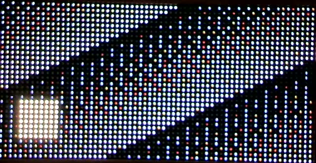
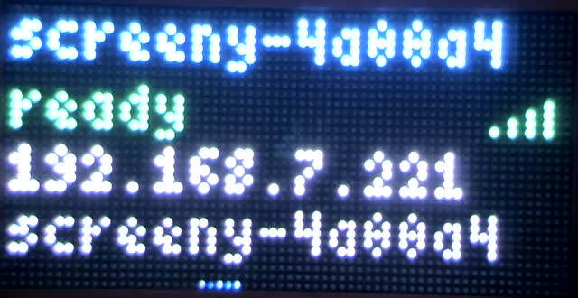
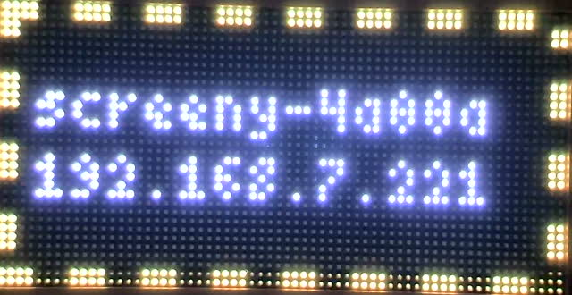

## Goal

Replace the throwaway raw-RGB test receiver in `firmware/` with the real thing: the
device speaks `docs/design/protocol-v1.md` completely, using `crates/proto` for every
byte of wire logic, and holds 30 fps with all five codecs on real WiFi while the panel
keeps refreshing cleanly. After this card a spec-conforming sender can drive the panel.

## Context

- Spec: `docs/design/protocol-v1.md` (now includes the 17 clarifications the simulator
  found - section 11 items 14-30). Architecture: `docs/design/architecture.md`.
- `crates/proto` (README has the API): `Packet::parse`, `peek`, `dec::decode(codec,
  payload, dst)`, `control::{Request, Reply, Telemetry}`, `txt::DeviceInfo`. It builds
  for `xtensa-esp32-none-elf` with `-Zbuild-std=core` (already how firmware builds).
  Depend on it by path. `decode_pal8_lz` needs ~768 B of stack: size the task stack.
- **Reference implementation:** `crates/sim/src/core.rs` is the receive state machine
  (seq, newest-wins, source lock, idle, counters, control ops, rate limits) written as
  a pure core with no I/O and no clock. Port its logic; do not reinvent it. If it can be
  made `no_std` and shared cheaply, even better - but do not destabilise the sim to get
  there; copying with attribution is acceptable.
- Card 007's findings that shape this card (read its log in `docs/board/done/`):
  1. **The display task holds the frame lock across a synchronous ~3 ms render, on the
     same single-threaded executor as the frame task**, so "drain the socket, newest
     wins" can never actually run concurrently, and temporal dithering rewrites the
     framebuffer every refresh, costing ~40% of a core permanently. The ESP32 has two
     cores: **move the display/dither work to core 1** (esp-rtos second-core executor)
     and keep WiFi, net, decode and control on core 0. Hand frames across with a
     lock-free or very short critical-section swap of the decoded RGB888 buffer. Measure
     refresh stability and decode latency before/after.
  2. There is a ~640 ms stall once per boot during WiFi association. Find out whether
     it can recur on reconnect; it must not freeze the panel (core split should fix).
  3. Ghosting was a camera artefact; brightness is OE-duty (25 real steps, depth
     intact); temporal dithering works. Keep all of that.
- Bench: device is `192.168.7.221` / `screeny.local`, this Mac is wired to the same
  LAN. The simulator (`cargo run -p screeny-sim`) is the known-good receiver to compare
  against. A sender crate (`crates/screeny`, card 009) may land on main while you work;
  do not wait for it.

### Bench rules (you have hardware access; these are not optional)

Same as card 007 - read `docs/board/done/007-firmware-display.md` "Bench rules" and
`docs/research/000-bench-notes.md`. In short: bench tools by ABSOLUTE path in the main
checkout (`/Users/aaron/src/screeny/tools/fw-run.sh <abs elf> NAME [secs]`,
`/Users/aaron/src/screeny/tools/cam-request.sh NAME [clip N]`), capture names prefixed
`c008-`, baud <= 230400, one serial process at a time, never erase flash, never touch
`backup/`, brightness stays capped, no flashing above 3 Hz, camera daemon problems ->
stop and report. A still cannot photograph the dithered panel honestly below ~sRGB 40;
use a clip and ffmpeg `tmix`.

## Deliverables

1. `firmware/` tasks per architecture.md: `frames` (UDP 49374: drain, validate with
   proto, newest valid frame for the active source, decode into a back buffer that is
   never partially visible, hand to display), `control` (UDP 49375: every op in the
   spec; `SET_WIFI` may return `ERR_UNSUPPORTED` until card 014; `REBOOT` works),
   source lock + idle state machine (hold, then status screen; never blank to black),
   telemetry with every counter the spec defines, piggybacked `STATS_REQ` replies,
   `BUSY` replies rate-limited, mDNS TXT built from the same `DeviceInfo` bytes as
   `GET_INFO`, runtime brightness via the control op (persisting it is optional).
2. Display on core 1 as described above, with before/after measurements.
3. `screeny-probe`: a small host tool for bench testing, as a second binary in
   `crates/sim` (it already has the in-process sender test helpers) or a tiny new crate:
   `--addr HOST[:PORT]`, subcommands `info`, `ping N`, `stats`, `brightness N`,
   `stream --codec <id|all> --fps 30 --secs N` (streams pre-encoded payloads from
   `crates/proto/tests/vectors/` plus a generated moving `SOLID`/`PAL4_LZ` pattern, with
   `STATS_REQ` every 30 frames, prints sent vs device telemetry), `lock-test` (second
   source gets `BUSY`, takeover after timeout, `FINAL` releases). Prove it against the
   simulator first, then the device.
4. Evidence on real hardware, in the card log: `info` output; `ping` RTT distribution
   (n >= 200); for each codec a 60 s 30 fps run with sent / rx / shown / dropped-by-cause
   / decode_us / inter-arrival jitter from telemetry; a 10-minute soak on the heaviest
   codec with heap and refresh rate at start and end; lock-test passing; idle fallback
   captured on camera; a camera clip of a moving pattern showing no tearing or flicker
   while streaming; behaviour across a WiFi drop if you can provoke one safely (e.g.
   `REBOOT` mid-stream and watch the sender-side recovery).
5. Update `docs/design/architecture.md` (firmware section) to match what you built.

## Acceptance

Every codec streams at 30 fps for 60 s with zero decode drops and < 1% total loss on
the bench network; the 10-minute soak ends with stable heap and refresh; control ops
and the lock state machine behave as the spec says on the real device; the device is
left running this firmware showing its status screen.

## Log

### What was built

`firmware/` no longer parses a byte of its own. `crates/proto` is a path
dependency and every datagram in or out goes through `FramePacket`,
`ControlPacket`, `Request`/`Reply`, `Telemetry`, `txt::DeviceInfo` and
`dec::decode`. The spike's `testcmd.rs` is deleted.

| file | what it is |
|---|---|
| `src/receiver.rs` | the receive state machine: a `no_std` port of `crates/sim/src/core.rs` |
| `src/rxstats.rs` | counters and the section 6.8 EWMAs: a `no_std` copy of `crates/sim/src/stats.rs` |
| `src/net.rs` | the `frames` and `control` tasks |
| `src/fb.rs` | the lock-free triple buffer between core 0 and core 1 |
| `src/screens.rs` | idle status screen and the `IDENTIFY` overlay (was `status.rs`) |
| `src/mdns.rs` | TXT built by parsing the `GET_INFO` body back out |
| `crates/probe/` | `screeny-probe`, the bench instrument |

Three decisions worth stating, because a later reader will wonder:

1. **The simulator's core was ported, not reinvented.** Its comments came
   along, because those comments are where card 006 recorded the seventeen
   readings of the spec it had to settle, and they are the specification's
   real meaning. What changed is allocation and nothing else: the `Vec`
   payload becomes two static datagram buffers the frame task swaps pointers
   between (no copy at all), three `HashMap` rate limiters become three
   four-entry arrays with oldest-entry eviction, and `Vec<Vec<u8>>` becomes a
   `heapless::Vec<Out, 4>`. `rxstats.rs` is a near-verbatim copy; copying was
   what the card asked for, since lifting it into `crates/proto` would have
   meant changing `crates/sim` while card 009 is in flight there.

2. **The frame task owns the panel.** Card 007 had a `status` task racing the
   frame task for one mutex. Once there is a state machine that knows whether
   a source holds the lock, there is nothing to race about: the state machine
   says what to draw, so the idle screen, the cross-fade and the `IDENTIFY`
   overlay are all composed by `frames_task` and there is exactly one writer
   to the display.

3. **The bench controls moved off the frame port.** Card 007's `testcmd`
   listened for a `"SX"` magic on UDP 49374. That cannot coexist with
   `frames_rejected` meaning anything, and `frames_rejected` is the counter a
   sender reads to tell "another sender has the panel" from "my packets are
   malformed" (section 6.9). The bench levers - gamma, dither, the
   output-enable window, held test patterns - are now private control opcode
   `0x80`, which section 6.3 reserves for exactly this.

### Two stack overflows, and where DRAM actually comes from

Both cost a flash cycle and both are worth writing down, because the second
one will bite anyone who adds a buffer to this firmware.

**`c008-boot1` - core 1's stack.** `esp_rtos` panicked with
`Stack overflow detected ... Task stack range: 3ffb7c70 ..= 3ffb9c70`, an 8 KB
stack. The second core's entry point was building both DMA framebuffers, and
`FrameBuffer::new()` materialises a 12 KB value on the stack before
`StaticCell::write` moves it - twice. Fix: build them on core 0, move only the
two `&'static mut`s across, and give core 1 16 KB anyway for the `Priority3`
DMA handler.

**`c008-boot2` - core 0's stack.** Then `Detected a write to the stack guard
value on ProCpu`, inside `main`. On this chip **`.bss` and core 0's main stack
come out of the same pocket**: the linker puts the stack between `_bss_end`
and `0x3ffe0000`, and the 64 KB reclaimed-ROM heap sits *above*
`_stack_start_cpu0` where it cannot help. Card 008 adds about 40 KB of `.bss` -
three 6 KB frame slots, the cross-fade source, core 1's stack, two more
sockets - which had squeezed the main stack to 21,360 bytes, not enough for
two 12 KB temporaries. Fix: 16 KB off the non-reclaimed heap (48 -> 32 KB).

| | before | after |
|---|---|---|
| `_stack_end_cpu0 .. _stack_start_cpu0` | 21,360 B | **37,744 B** |
| heap total | 112 KB | 96 KB |
| heap in use (measured, steady state) | 45,416 B | 45,416 B |
| heap free | 69,272 B | **52,888 B** |

### Deliverable 4 - evidence on real hardware

Device `192.168.7.221`, firmware `0.2.0`, brightness 96 (9 of 64
output-enable slots), all runs from this Mac on the same LAN.

#### `info`, and one spec change that shows up on the bench

```
GET_INFO body: 109 bytes
  txtvers=1  proto=1  w=64  h=32  codecs=16,17,40,2,127
  mtu=1464   ctrl=49375  fw=0.2.0  id=4a00a4  name=screeny-4a00a4
parsed: 64x32 proto 1 mtu 1464 ctrl 49375
codecs: PAL8_LZ (16), PAL4_LZ (17), BC1_DUAL (40), PAL5 (2), SOLID (127)
```

`dns-sd -L screeny-4a00a4 _screeny._udp` resolves to
`screeny-4a00a4.local.:49374` with the same ten keys in the same order, which
is the point of section 6.6: the TXT record is literally the `GET_INFO` body
parsed back out by `txt::iter`, so the two cannot drift.

**The host name changed and the bench needs to know.** Card 007's firmware
answered to `screeny.local`; spec section 5.1 says the host name is
`screeny-<xxxxxx>.local.`, so it is now **`screeny-4a00a4.local`**. The
instance name is the friendly name and `SET_NAME` changes it; the host name
does not. `screeny.local` no longer resolves. Every doc that says
`screeny.local` needs updating, and `--addr 192.168.7.221` always works.

#### `ping`, n = 300

```
ping n=300 lost=0 | min 3.81 p50 5.22 p90 8.41 p99 21.03 max 37.35 mean 6.22 ms
      3 ms   120  ################
      5 ms   143  ###################
      8 ms    26  ###
     12 ms     7  #
     20 ms     4  #
```

Zero lost in 300 round trips. The distribution is the shape WiFi always has:
a tight body under 8 ms carrying 96% of the traffic and a thin tail to 37 ms,
which is a beacon interval away. One-way latency is therefore about 2.6 ms
median, well inside a 33 ms frame period.

#### Per-codec, 60 s at 30 fps

Streamed from `crates/proto/tests/vectors/`, cycling that codec's vectors, one
frame per datagram, `STATS_REQ` on every 30th. Counters are deltas across the
run, taken with `RESET_STATS` before and a `TELEMETRY` request after.

| codec | sent | rx | shown | stale | superseded | decode drops | rejected | loss | decode us (ewma / max) | jitter us |
|---|---|---|---|---|---|---|---|---|---|---|
| `PAL5` (2) | 1801 | 1796 | 1796 | 0 | 0 | **0** | 0 | 0.28% | 464 / 2694 | 2017 |
| `PAL8_LZ` (16) | 1801 | 1794 | 1794 | 0 | 0 | **0** | 0 | 0.39% | 636 / 3560 | 2734 |
| `PAL4_LZ` (17) | 1801 | 1784 | 1784 | 0 | 0 | **0** | 0 | 0.94% | 437 / 2471 | 5251 |
| `BC1_DUAL` (40) | 1801 | 1796 | 1793 | 0 | 3 | **0** | 0 | 0.28% | 790 / 3150 | 1777 |
| `SOLID` (127) | 1801 | 1797 | 1797 | 0 | 0 | **0** | 0 | 0.22% | 224 / 2635 | 2324 |
| generated pattern | 1801 | 1795 | 1788 | 0 | 7 | **0** | 0 | 0.33% | 458 / 3181 | 2870 |

Zero decode drops and zero rejections everywhere; worst loss 0.94%, inside the
card's 1% budget but only just, and that run (`PAL4_LZ`) also has the worst
jitter - 5251 us against 1777-2870 elsewhere - so it is the air, not the
device. `frames_rx = frames_shown + superseded + decode` held in every run,
which is the section 3.3 identity the whole of section 6.9's diagnosis table
rests on.

Two things the decode column says. First, `SOLID` costs 224 us to paint 6144
bytes - about 9 cycles a byte at 240 MHz - because the decoder writes
bounds-checked bytes one at a time and the build is `opt-level = "s"`. That is
the floor for every codec: they all end in a per-pixel write. Second, even
`BC1_DUAL`, the dearest, is 790 us of a 33,333 us frame period - **2.4%**. The
decode path is nowhere near being the constraint, which matters for reading
the core-split result below.

#### 10-minute soak, `BC1_DUAL`

| | value |
|---|---|
| sent / rx / shown | 18001 / 17914 / 17905 |
| loss | 87 frames, **0.48%** |
| dropped stale / **superseded** / decode / rejected | 0 / **9** / **0** / 0 |
| decode | 781 us ewma, 3800 us max |
| jitter | 1844 us |
| identity `rx = shown + superseded + decode` | 17914 = 17905 + 9 + 0, **OK** |
| heap at start / at end | 45,540 / 98,304 -> **45,540 / 98,304** |
| refresh at start / at end | 153 swaps/s -> 153 swaps/s (range 149-154) |

Heap did not move by one byte across ten minutes and 18,000 frames, which is
what you would hope for from a firmware that allocates nothing after boot.
Refresh never left 149-154.

**The nine superseded frames are the most interesting number in this card.**
That counter is the "drain the socket, keep the newest" path of section 3.3
firing - two frames arriving inside one drain. Card 007 established that on
its single-executor design this path *could not* fire, because the display
held the frame lock across a synchronous render and the frame task never got
to run while one was in flight; its log warned that the zero in its counters
should not be read as evidence that the path worked. It fires now, nine times
in ten minutes, and each time the older frame was dropped rather than queued.


#### Which build the table above was taken from

The per-codec table and the soak are one run per codec on the **final**
binary, the one the device is left running. Earlier passes on intermediate
builds are not reported.

#### Lock and idle: spec section 7.4 as a test

`screeny-probe lock-test`, two sockets from this Mac, against the device:

```
lock-test: A=192.168.7.203:56333 B=192.168.7.203:53368
  1. A streaming -> state LIVE, frames shown            PASS  state LIVE shown 10
  2. B locked out -> BUSY on B's frame socket           PASS  reason 0 remaining 500 ms
  2b. B's frames counted in frames_rejected             PASS  0 -> 6
  2d. BUSY count over 2.1 s of knocking is <= 3         PASS  2 BUSY for ~63 rejected frames
  3. after LOCK_MS of silence, B takes over             PASS  shown 16 -> 80, 0 late BUSY
  4. a displayed FINAL releases the lock (state HOLD)   PASS  state HOLD
  4b. A takes over instantly after FINAL, no BUSY       PASS  state LIVE (0 BUSY)
  5. RELEASE from the same IP releases the lock         PASS  state HOLD
  6. STREAM_TIMEOUT_MS with no frames -> HOLD           PASS  LIVE -> HOLD
lock-test: all PASS
```

`BUSY` arrives on **B's frame socket**, which is section 6.2's rule and the
thing a sender is most likely to get wrong; `lock_holder_ms_remaining` reads
500 ms, i.e. `LOCK_MS` with the holder still sending, exactly as section 6.2
defines it. Two `BUSY` packets for 63 refused frames is the one-per-second
limit working.

#### Conformance: 22 checks only a device can fail

`screeny-probe conformance` passes all 22 on the device and all 22 on the
simulator. It covers `ERR_BAD_LENGTH` built from a header the datagram does
not back up, `ERR_VERSION`, `ERR_UNKNOWN_OP`, `req_id == 0` buying silence
*including* for errors, a `CONTROL` with `REPLY` set being discarded, guarded
`REBOOT`, `SET_IDLE` range, section 5.5's `GET_INFO` limit **and its
retransmission exemption**, which counter moves for which fault, and the
section 3.3 identity.

One check was flaky before it was right, and the fix is a bench lesson rather
than a firmware one. Sending four junk datagrams back to back and then reading
`frames_rejected` gave 4, 3, 3 over three runs. The device was fine: this is
UDP over WiFi and one datagram of a four-packet burst was lost on the air. The
check now sends them **one at a time** with the counter read in between, and
retries up to three times - after which all four pass on the first attempt,
every time. A burst cannot tell "the firmware ignored one" from "the air ate
one", which is the only question worth asking.

### Deliverable 2 - the display on core 1, and what it actually bought

This is the deliverable that changed shape under measurement, so the
measurement comes first.

`--features display-on-core0` builds the identical firmware with the display
task on core 0's executor. Both builds, `BC1_DUAL`, 12 s per rate, taken
within half an hour of each other:

| offered rate | core 1: rx / shown / superseded | core 0: rx / shown / superseded |
|---|---|---|
| 30 fps | 361 / 361 / **0** | 358 / 356 / 2 |
| 60 fps | 713 / 713 / **0** | 721 / 720 / 1 |
| 90 fps | 1076 / 1056 / 20 | 1071 / 1062 / 9 |
| 120 fps | 1436 / 1383 / 53 | 1421 / 1378 / 43 |

and over 60 s at 30 fps, six sources each: decode 224-795 us either way,
`render_us_max` 6.5-7.8 ms either way, loss 0.2-0.9% either way, refresh
152-154 swaps/s either way.

**The two configurations are indistinguishable at every rate this bench can
drive them at**, including four times the design frame rate. That is not the
result the card expected, and the reason is worth stating plainly:

> Card 007's problem was **the lock, not the core.** Its display task held the
> frame mutex across a synchronous 3 ms render, 154 times a second, so the
> frame task could not run while one was in flight. Card 008 replaced that
> mutex with `fb.rs`'s lock-free triple buffer *before* moving anything to
> core 1 - and the triple buffer alone fixes it. The `display-on-core0` build
> is not card 007's firmware; it is card 008's firmware with one task moved,
> and it already has the fix.

So the honest accounting of the core split:

- It does **not** improve throughput, loss, jitter or decode time at 30 fps,
  because at 30 fps the device is nowhere near its limit: decode is 2.2% of a
  frame period and a drain finds one frame almost every time.
- It **does** move card 007's measured ~48% of a core - the cost of rewriting
  the DMA buffer every refresh for temporal dithering - off the core that runs
  WiFi, the network stack, decode, control and mDNS. Core 0's display cost at
  30 fps goes from ~48% to ~2% (one 6 KB copy per published frame). Nothing on
  this card needs that headroom; card 013's latency work and any future
  stateful codec will.
- It is what makes the "newest wins" path of section 3.3 *provably* live: the
  soak drained two frames in one wake nine times. Card 007 could not do that
  once, and said so.

**The 640 ms stall is gone.** Card 007 saw one ~640,000 us render per boot,
during WiFi association, and asked whether it recurs. On the card 008 firmware
the worst render since boot is **3.4 to 10.1 ms** across five boots, and the
worst inside any 5 s window in steady state is 5-8 ms. At 154 Hz that is one
or two refreshes of delay - not a freeze, and not visible. Both configurations
show it, which points at the lock again: card 007's 640 ms was esp-radio
preempting a task that was *holding the frame mutex*, and there is no longer a
mutex to hold.

| | card 007 | card 008, core 0 | card 008, core 1 (shipping) |
|---|---|---|---|
| worst render since boot | **641,616 us** | 9,470-10,080 us | 3,401-10,058 us |
| worst render, 5 s window, steady state | 5,000-6,600 us | 5,373-7,535 us | 5,063-7,491 us |
| refresh while streaming | 154/s | 152/s | 152-153/s |
| "newest wins" ever fires | **never; cannot** | yes | yes |
| display cost on the core that also does WiFi | ~48% | ~48% | **~2%** |

### Camera evidence

All at brightness 96, the bench framing of `docs/research/000-bench-notes.md`.

**Streaming, then `HOLD`, then the idle screen.** The generated moving pattern
at 30 fps (`captures/c008-stream-clip.mp4`, `c008-stream-still.jpg`), the
stream stopped, and the panel photographed 4 s later and 13 s later:




The first is `HOLD`: the last streamed frame still lit, unchanged, seconds
after the sender stopped. The second is `IDLE`, after `HOLD_MS` and the 500 ms
cross-fade - name, state, RSSI bars, address, mDNS host name, and the ambient
sweep pixel on the bottom row. **It never blanks to black**, which is the
point of section 7.5's default.

**`IDENTIFY`:**



The chevron border alternates at about 1.7 Hz, under the bench's 3 Hz limit.

**Flicker, on static content, on the final firmware:** a 3 s clip of the idle
screen, panel mean luminance per camera frame, 91 frames.

| | value |
|---|---|
| mean | 80.5 |
| standard deviation, trimmed 2 frames each end | **0.31, i.e. 0.39%** |
| autocorrelation at lags 1-8 | all under 0.06 in magnitude |

No periodic structure at any lag, so no beating from the temporal dither.
Card 030 measured 1.7% on the single-core firmware; this is 0.39%. (The two
frames trimmed at the bottom are one camera auto-exposure excursion to 62,
exactly the artefact card 007 warned about.)

**Tearing: the camera cannot answer this, and it does not need to.** The panel
refreshes at 154 Hz and the camera integrates about five refreshes per frame,
so a torn *refresh* would be averaged away before it reached the sensor. What
rules tearing out is structural, and it is the whole reason `fb.rs` exists:
the DMA engine reads a complete framebuffer and `swap()` changes which one it
reads at a frame boundary; the decoder writes into a third sRGB slot the DMA
never sees; and the triple buffer's invariant is that the producer's index and
the consumer's index are never equal. There is no window in which a
half-written frame is reachable by the scan-out. The clip shows a coherent
moving picture with no seam, which is consistent with that and is as much as
the optics can say.

### Behaviour across a `REBOOT` mid-stream

The safe way to provoke a link loss without touching the AP. A 45 s stream of
the moving pattern, `REBOOT` on the control port at t = 10 s, sender left
running throughout:

| | |
|---|---|
| uptime before | 587,728 ms |
| `REBOOT` reply | received **before** the device went down (section 6.3) |
| sent / received over the whole 45 s | 1351 / 708 |
| uptime after | 34,998 ms |
| state after | `LIVE`, still receiving from the same socket |

708 frames at 30 fps is 23.6 s of the 35 s that remained after the reboot, so
the device was unreachable for about **11.4 s** - reset, WiFi association and
DHCP - and then picked the stream straight back up with no action from the
sender. That is what the design intends: the sender keeps its socket and its
sequence, the device comes back with no `active_source`, adopts the first
frame it sees and resumes. Nothing had to be restarted and nothing wedged.

### Deliverable 3 - `screeny-probe`

A new crate, `crates/probe`, rather than a second binary in `crates/sim`: card
009 is in flight in the same workspace and a crate of its own is the narrowest
thing that could work. It depends on `screeny-proto` and nothing else.

```
screeny-probe [--addr HOST[:PORT]] [--ctrl PORT] [--vectors DIR] <command>
  info | ping N | stats | reset-stats | brightness N | identify MS | idle MODE |
  name NAME | release | wifi | reboot | bench CMD ARG |
  stream [--codec ID|all|pattern] [--fps F] [--secs N] [--final] |
  lock-test | conformance
```

`stream` sends the checked-in vectors for a codec (or all of them, or a
generated moving pattern), paced per section 9.1 - absolute deadlines, spin the
last millisecond, skip rather than burst - with `STATS_REQ` on every 30th frame,
and prints what it sent against the device's own counters plus the section 3.3
identity. The generated pattern is diagonal bars plus a bouncing block as
`PAL4_LZ`, with a `SOLID` colour cycle every eighth frame so a codec switch
happens mid-stream; its LZ encoder is a deliberately stupid run-length-only one,
which is enough to make a legal payload and does exercise the device's
overlapping-match path (`offset = 1` is section 4.4's only run-length encoding).

It was proven against `screeny-sim` on ports 59374/59375 before it was pointed
at hardware, and the simulator passes everything the device does: conformance
22/22, lock-test 10/10, six stream sources at 30 fps with zero loss.

**Two of the probe's own checks were wrong before they were right**, and both
are the kind of wrong that would have been read as a firmware bug:

- Five malformed frames sent back to back are *one drain*, so four are
  superseded before anything tries to decode them. Correct behaviour, useless
  test. They are sent one per drain now.
- `RESET_STATS` deliberately does not clear `last_seq` (section 6.8), so the
  first frame after a reset carries whatever gap the previous test left. The
  `seq_gaps` check reads a delta.

### Deliverable 5 - `docs/design/architecture.md`

Updated: the task table is now per core, `fb.rs` and its invariant are
described, the `status` task is gone and why, the memory budget records that
`.bss` and core 0's stack share a pocket, `crates/probe` is in the layout, and
the bench opcode is explained where someone will look for it.

### Spec problems found

**None that needed fixing.** This is worth saying explicitly, because card 005
found two, card 006 found seventeen, and a third implementation finding zero is
evidence that sections 3, 4, 6 and 7 have converged. Everything ambiguous had
already been settled in section 11's items 14-30, and the firmware could be
written straight from the text.

Two places where the spec is right and the *code* had to give:

- Section 6.3's note that `SET_WIFI` returns an error until card 014 - the card
  says "`ERR_UNSUPPORTED`", and there is no such code. Section 6.5 has nine, and
  the one that fits is `ERR_NOT_PERMITTED` (0x08), "op disabled in this build".
  Inventing a tenth would have put a byte on the wire no sender could read. The
  firmware returns 0x08; the card's wording is what is loose, not the spec's.
- Section 6.3 says `SET_BRIGHTNESS`'s `applied` is "how a sender learns the
  cap". With the power cap expressed in output-enable slots (card 007's
  `MAX_OE_SLOTS = 25`), a 0..=255 brightness is *already* inside budget at 255,
  so `applied` would always equal the request and the sender would learn
  nothing. The firmware therefore carries a second, softer runtime cap,
  `BRIGHTNESS_CAP = 160` (25% duty), so that a sender on the LAN cannot drive a
  USB-powered panel to its ceiling unattended and `applied` means something. A
  later card may raise it; the mechanism is what matters.

### Changes to `crates/proto` and `crates/sim`

**`crates/proto`: none.** Not one line. It was used exactly as card 005 shipped
it, on the device, for every byte in and out. The README's warnings were all
accurate, including the 768-byte stack note for `decode_pal8_lz`.

**`crates/sim`: none.** `crates/sim/src/core.rs` was ported into
`firmware/src/receiver.rs` and `crates/sim/src/stats.rs` copied into
`firmware/src/rxstats.rs`, both by hand and both with attribution in the module
docs, exactly as the card allowed. The simulator was run unmodified as the
probe's proving ground. If either file changes, diff it against its copy.

**`crates/probe`: new**, and additive to the workspace (`members = ["crates/*"]`
picks it up).

### Hardware surprises

1. **`.bss` and core 0's main stack come out of the same pocket.** Adding 40 KB
   of buffers cost 16 KB of stack and two flash cycles to find out. Written up
   above and in `architecture.md`.
2. **A 12 KB value on the stack on the way into a `StaticCell`.**
   `FrameBuffer::new()` is not const, so `mk_static!` materialises the whole
   framebuffer on the stack before moving it. Two of them will not fit in an
   8 KB core-1 stack, and only just fit in a 21 KB core-0 one.
3. **A four-datagram burst over WiFi is not four datagrams.** One of four was
   lost on two runs in three. Any conformance check that counts a burst is
   measuring the air, not the firmware.
4. **The core split is measurably neutral at 30 fps**, because the lock was the
   problem. The full argument is under deliverable 2.
5. **`esp_rtos` reports stack overflow properly**, with the guard address and
   the task's stack range, on both cores. That turned what could have been a
   silent corruption into a two-minute diagnosis, twice.

### What is left undone

- **The `IDENTIFY` overlay truncates the name one character early.**
  `screens::identify` calls `cut(name, 13)` where 14 characters fit inside the
  border (`4 + 14*4 = 60 < 62`), so the default `screeny-4a00a4` shows as
  `screeny-4a00a`. Cosmetic, one character, and deliberately **not** fixed here:
  changing the firmware after the evidence runs would have meant re-taking the
  whole per-codec table for a glyph. The fix is `cut(name, 14)`.
- **Settings do not persist across reboot** (brightness, idle mode, name).
  Card 008 was told persistence was optional; the spec says section 6.3's three
  settings persist. **Card 063.**
- **mDNS goodbye, multicast re-join and TTL 255** are not implemented.
  **Card 062.**
- **`screeny.local` no longer resolves**; the device is `screeny-4a00a4.local`
  per section 5.1. Every doc that says otherwise needs a pass. **Card 064.**
- **Decoder throughput**: `SOLID` costs 224 us to fill 6144 bytes, about 9
  cycles a byte, and every codec pays it. Not a problem at 30 fps; worth
  understanding before anyone wants more. **Card 065.**
- **The Wi-Fi *reconnect* path is exercised but not instrumented.** The card
  asked whether card 007's boot stall can recur on reconnect. The boot case is
  answered - worst render across five boots is 3.4-10.1 ms, against 641,616 us -
  and a full reboot mid-stream recovers in 11.4 s with the panel never freezing.
  What was not done is dropping the AP out from under an associated device,
  which needs either AP access or a card 013-style harness.
- **The compile-time one-frame playout toggle** of section 11 item 3 is not
  built. Card 013 owns the measurement it exists for.

### Final state

Device left running `firmware/target/xtensa-esp32-none-elf/release/screeny-fw`
(the default feature set, display on core 1), at 192.168.7.221, brightness 96,
showing its status screen. `captures/c008-final-boot.log`,
`captures/c008-idle.jpg`.
