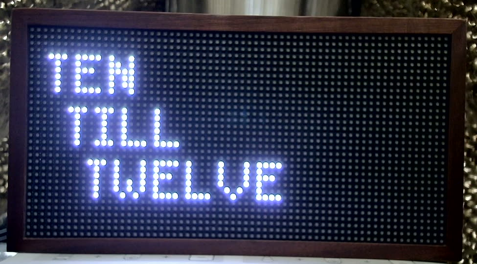
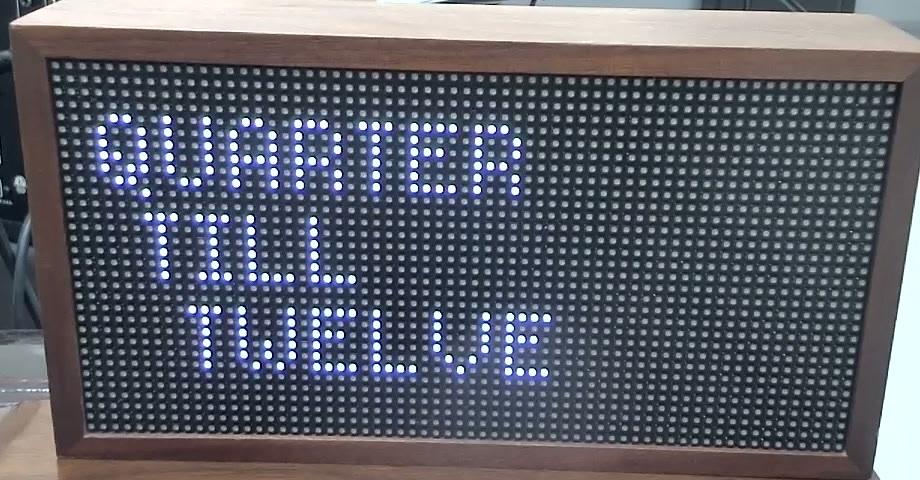

# Bench notes

The author's bench, for the record.

## Device

Tidbyt Gen 1: ESP32-D0WD-V3 rev 3.0, dual core 240 MHz, 8 MB flash, 40 MHz crystal,
MAC b4:8a:0a:4a:00:a4, CP2102N on `/dev/cu.usbserial-XXXX`. Stock firmware strings
mention `tidbyt/atca` (an ATECC secure element on I2C), `tidbyt/ble`, a button, and
ESP-IDF. Partition table and restore instructions: `backup/README.md`.

Serial link corrupts long transfers at 460800 baud and above. Use 230400.
Auto-reset into the bootloader over DTR/RTS works; no button press needed.

## Camera

Anker PowerConf C200, avfoundation. A sandboxed terminal cannot get macOS camera
permission, so captures go through `tools/cam-daemon.sh` running in Terminal.app.
Start it with `open -a Terminal tools/cam-daemon.sh`. It is single-instance; a second copy exits immediately.
Request captures with:

    tools/cam-request.sh NAME           # -> captures/NAME.jpg
    tools/cam-request.sh NAME clip 3    # -> captures/NAME.mp4 (3 s)

ffmpeg quirks: the camera advertises exactly 30.000030 fps and `-framerate 30` fails
with "Could not lock device for configuration"; pixel format must be one of
uyvy422/yuyv422/nv12; pass `-nostdin`. Modes: 320x240 up to 2560x1440, all 30 fps.

### Framing (as of 2026-09-19, after the camera was repositioned)

Panel is square-on with a dark backdrop. In the 1920x1080 frame the LED grid spans
roughly x 405-1560, y 210-805 (about 18 camera px per LED pitch), with a slight
keystone: the right edge sits a few pixels lower than the left. These numbers are
eyeballed; the precise homography comes from card 012, which lights the four corner
pixels from our own firmware and locates them in a capture. Redo it if the camera
or panel is bumped.

Fully lit white-blue LEDs still clip in the camera at stock brightness. Dim the
panel from firmware for any colour measurement.

## Stock word clock (reference for the word-clock sender)

At 11:43 the stock app shows three lines, "QUARTER / TILL / TWELVE", upper case,
blue-white on black, a ~5x7 pixel font with 1 px spacing, each line indented a few
pixels further than the last (a staircase), top-left anchored with a ~3 px margin.
Time is rounded to the nearest five minutes and phrased colloquially.
