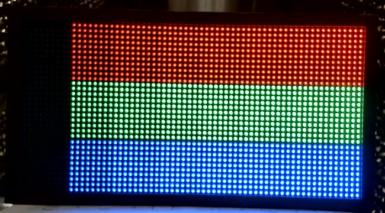
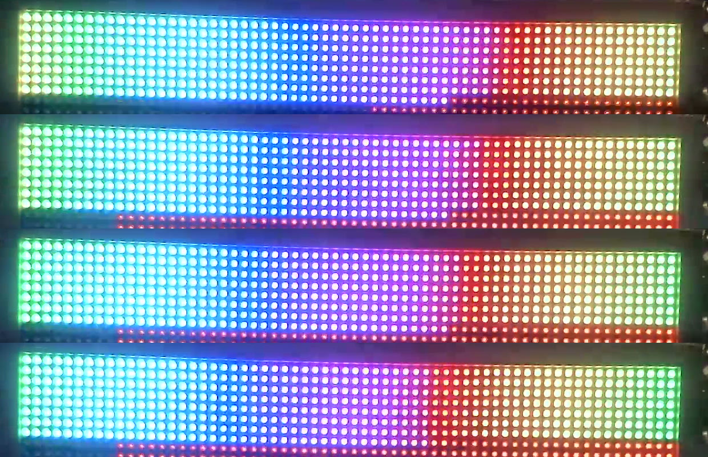

# First hardware bring-up (2026-09-19)

`spike/fw-skeleton` (card 001) flashed to the Tidbyt. Result: **the whole stack works
on real hardware on the first day** - panel, WiFi, DHCP, mDNS, UDP receive, display.

(The spike directory itself was deleted by card 016 once `firmware/` had superseded
it; git history keeps it. What it proved is still true.)

## Results

| Item | Result |
|---|---|
| Panel init | Lights with the ported FM6124 init. Not yet tested without it. |
| Refresh | 154 Hz, 6 bit planes, 10 MHz pixel clock. No visible flicker on camera at 30 fps. |
| Colour order | **Rotated on this unit.** The lines the hdk names R/G/B drive blue/red/green. Fixed by mapping red=GPIO2/4, green=GPIO22/27, blue=GPIO21/23. Feeds card 021. |
| Geometry | Test pattern bands and ramps land where expected; no shift or garbling, so clock phase is right. Mirroring not yet proven (needs an asymmetric pattern). |
| WiFi | Joins the bench network (the SSID is case-sensitive, and a wrong-case first letter cost a debugging round: the scan printed the real name) on 2.4 GHz ch 1, RSSI about -41 dBm, WPA2. Three APs share the SSID. ~9 s from reset to DHCP lease. |
| mDNS | Works. `dns-sd -B _screeny._udp` finds `screeny`, `screeny.local` resolves. Multicast through esp-radio is fine - risk 5 from card 001 is retired. |
| UDP receive | 30 fps sent from the Mac (wired ethernet -> AP -> WiFi), **29 fps shown, 0 dropped** over 14 s, 1470-byte datagrams. Camera shows smooth motion, no tearing. |
| ICMP | Device does not answer ping. ARP works. Low priority, but handy for debugging. |
| Heap | 45 KB used of 112 KB with WiFi associated and idle. |

## Problems seen

1. **Ghosting**: faint red copies of lit rows appear one or two rows below the lit
   area. Try esp-hub75 `trail-blank-N` / `inter-row-blank-N` features.
2. **Too bright for the camera** at the current cap: lit LEDs clip. Card 020
   (brightness without losing bit depth) matters for measurement as well as comfort.
3. The first ramp columns are black: at 6 linear bits with the brightness cap, low
   values round to zero. Expected; shapes the codec work (card 002).

## Bench workflow

`tools/fw-run.sh <elf> <name> [secs]` flashes at 230400 baud, logs serial to
`captures/<name>.log`, and takes a camera still. Note `espflash monitor` resets the
chip when it attaches, so every log starts from boot.
