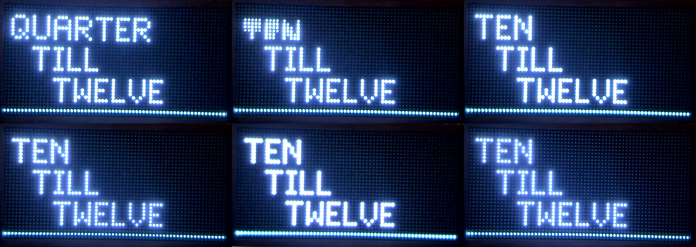
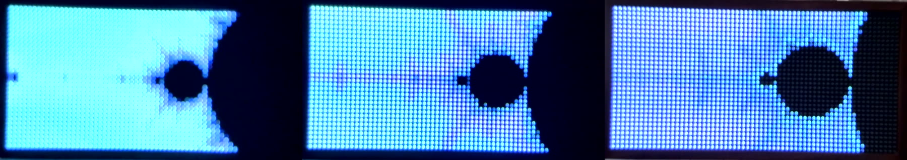

# End to end on the real panel (2026-09-19)

First run of the whole system: the signed `screeny` sender (card 009 + demos from
card 010) streaming over WiFi to the embassy firmware (cards 007 + 008) through
`crates/proto` (card 005), observed by the bench camera.

| Demo | fps sent | bytes/frame | codec | encode ms (mean / p95) | device drops |
|---|---|---|---|---|---|
| `screeny clock` | 30.1 | 266-283 | `PAL4_LZ` 100%, bit-exact | 0.10 / 0.50 | 0 |
| `screeny fractal --seed 7` | 30.1 | 1284 | `PAL8_LZ` | 1.39 / 2.50 | 0 |

Word clock transition, 6 camera frames across the change ("QUARTER" rolls out, "TEN"
rolls in, the unchanged words stay put):

Fractal zoom, 3 camera frames over 7 s:

Device-side numbers from card 008's evidence runs: every codec 60 s at 30 fps with zero
decode drops and 0.2-0.9% network loss; decode 0.2-0.8 ms; 10-minute soak with heap
and refresh unchanged; ping RTT p50 5.2 ms / p99 21 ms, 0 of 300 lost; `REBOOT`
mid-stream recovers in 11.4 s without the sender restarting.

## Notes

- The device's mDNS host name is `screeny-c0ffee.local` (spec 5.1: `screeny-<id>`);
  the instance name is `screeny-c0ffee`. `screeny.local` was the bring-up spike's
  name and no longer resolves. `--addr 192.168.1.50` always works.
- One `screeny discover` returned nothing on the very first launch after the binary
  was re-signed; the next five discoveries succeeded. Unexplained; watch for it
  (candidates: macOS evaluating the fresh signature for Local Network, or the
  firmware's missing mDNS re-announce, card 062).
- The fractal's leg openings are large, bright, nearly flat fields: they clip the
  bench camera and are the least interesting frames. Art direction, not plumbing.
- Text at brightness 96 still blooms to white in the camera. Card 061 (camera
  exposure) stands between us and colour-accurate measurement (cards 012/013).
