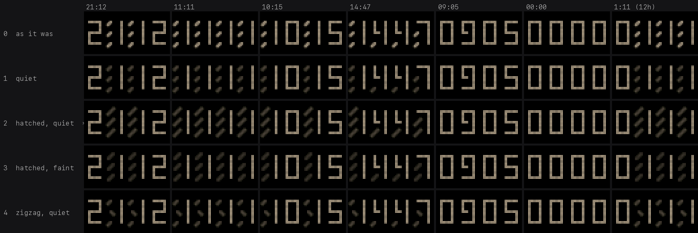
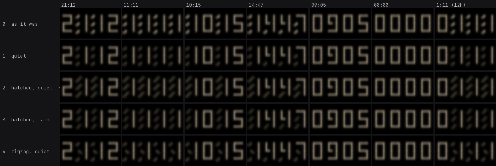
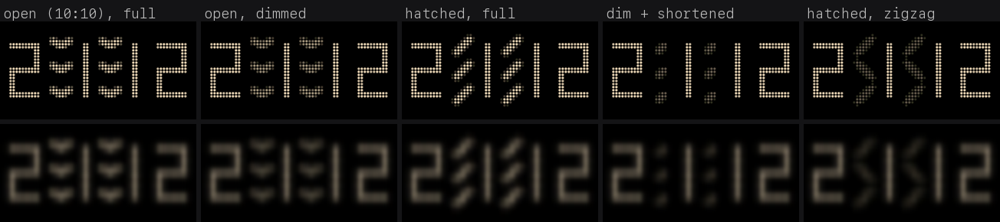

# The numerals clock's rest pose: why `21:12` read as `2:1:12`

Card 160. Contact sheets for the owner to judge against; the treatments are switchable
live from the studio (`clocks-numerals`, parameter **Resting dials**), because the real
test is the panel from across the room and neither a preview nor a camera can stand in
for it.

## Conclusions

1. **The defect is real at every time containing a `1`, `4` or `7`**, not just at 21:xx.
   `14:47` is worse than `21:12`: it reads as `1,4,4,7` - the rest strokes land where
   commas would.
2. **Dimming alone is not enough.** A short stroke dimmed is still a dot, and three dots
   in a column are still a colon once the eye is more than a few feet away (row 1 of the
   squint sheet).
3. **The pose has to leave the digits' axes.** Every digit stroke is up, down, left or
   right, so a *diagonal* rest pose - the hour hand at 7:30 and the minute hand at 1:30,
   one stroke corner to corner, a dial reading about 1:37 - cannot be read as part of a
   glyph, and it survives blur: three blurred dots are a colon, three blurred slashes are
   a texture.
4. **Diagonal + dim is the answer**, and it is the shipped default (`rest` = 2, "hatched,
   quiet"). Dim alone leaves punctuation; diagonal alone is *louder* than the digits
   (1.27x the light of a digit dial, measured in the test) and the digits stop leading.
5. **It costs nothing on the wire.** Dimming a hand is its own ink scaled in linear
   light, which is exactly what its anti-aliasing ramp already is, so a dim hand lands on
   a step of that ramp: 31 colours in every treatment, still an exact frame.
6. Resting dials only recede **while the time is being held**. During a dance every hand
   is a dancer and the grid is drawn at full strength; the picture settles onto the time
   over 0.6 s as the hands land.

## The sheet

Rest treatments down, the awkward times across. Rendered with
`screeny-art snapshot clocks-numerals`, the time pinned through the `offset` parameter,
`still=60` so the hands are holding the time and not dancing. `09:05` and `00:00` have no
resting dials at all, so their five rows are identical: they are the control.

The same sheet blurred down to about half the panel's resolution - "from across the
room", which is how the owner reads it and the only test that separates the candidates:

Read row by row:

| | |
|---|---|
| 0 `as it was` | `2:1:12`, `1:1:1:1`, `:10:15`, `:1,4,4,7`. The bug. |
| 1 `quiet` (7:30, dimmed to 0.20) | Better close up, still punctuation at distance. Kept as the option that changes only brightness: it is the most faithful to the original's rest pose, and the owner may disagree with the squint test on real LEDs. |
| 2 `hatched, quiet` | **The recommendation.** Diagonal, dimmed to 0.20. Reads `21 12`, `1447`; the marks read as texture. |
| 3 `hatched, faint` | The same at 0.10 and drawn 10% short, if 2 is still too present on the panel. About as faint as a hand can be and stay a hand: at this ink it is roughly 6 of the panel's 64 levels. |
| 4 `zigzag, quiet` | The per-row idea: odd rows mirror the pose so a column never repeats. It does break the straight line, but three small dim marks are still three small dim marks; I do not recommend it. Kept switchable because it is worth one look on the panel. |

## Rejected, with the reason

- **Both hands open, "10:10"**: the wide V fills the cell across and reads as a horizontal
  bar or an arrowhead - it joins the digits' vocabulary instead of leaving it. Worse
  dimmed, because the shape is what fails, not the brightness.
- **Diagonal at full brightness**: measurably louder than a digit dial (1.27x its light),
  so the hatching leads and the numerals follow.
- **Dimmed and shortened**: shortening pulls the mark to the centre of its cell, which is
  exactly where a colon's dots go. The cleanest colon on the sheet. Length must stay long
  enough to keep the mark off-centre and slanted.
- **Diagonal, mirrored per row**: alternating `/` and `\` makes `>` and `<` chevrons down
  the column - punctuation again, just different punctuation.

## How it was rendered

The piece reads the wall clock, so a time is pinned by choosing a fractional `offset`
(minutes) that puts the simulated clock exactly on the target minute's boundary at the
start of the warmup, with a warmup long enough (26 s) for the first dance to land and
short enough that the next one has not set off. `--set still=60` holds the time. Seed 7,
`dance=1` so the sheet is the same picture every time it is built.
